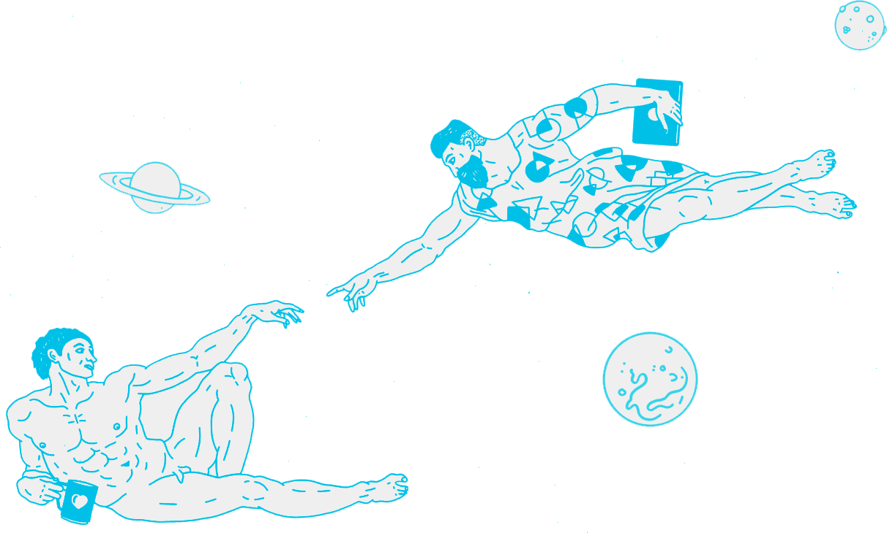
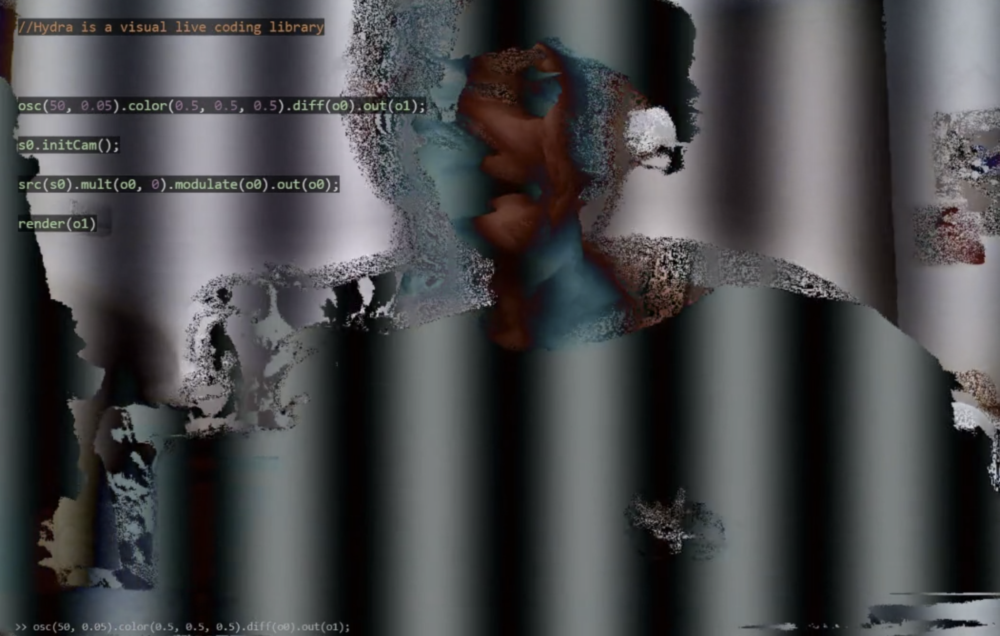

# Hello

Welcome to a wishful remedy to the increasing knowledge gap between those who build machines, and those who use them. A repository of complementary learning materials for software, hardware and code, open to everyone.

## Streaming workshops during COVID-19

In 2020 we streamed workshops on [Twitch](https://www.twitch.tv/exploringtechnology) from April 3-17. More information in the [Facebook event](https://www.facebook.com/events/524433344931172/). All videos can be viewed in the [Exploring Technology Live playlist](https://youtu.be/ZoaCwD4TLeI?list=PLUDp_pSeLkVSih5Ftqll9MTzgZ3IL5URq).

## Workshops

| Date | Topic | Host |
| :--- | :--- | :--- |
| 0403 | [Generative Design](learn/generative-design/p5/background.md) | [Jonas Johansson](https://jonasjohansson.se/) |
| 0406 | Intro to TouchDesigner | [Mickey van Olst](https://mickeyvanolst.com/) |
| 0407 | Browser AR using [A-Frame](learn/mixed-reality-1/aframe/) and AR.js | Jonas Johansson |
| 0408 | Algorithmic sounds in [SuperCollider](learn/sound-production/supercollider.md) | [Daniel M. Karlsson](https://www.danielmkarlsson.com/) |
| 0409 | [Point clouds](learn/live-visuals/touchdesigner/point-clouds/) in TouchDesigner and MetaShape | Mickey van Olst |
| 0410 | Machine Learning with [Runway]() | [Andreas Refsgaard](https://andreasrefsgaard.dk/) |
| 0411 | Live coding networked visuals in Hydra | [Annie Tådne](https://tadne.se/) |
| 0413 | GLSL and Advanced TOP in TouchDesigner | [Anton Heestand](http://hexagons.net/) |
| 0414 | [Enhanced radical knitting using JavaScript and the Terminal](guides/enhanced-radical-knitting.md) | [Alexander Wallin](https://www.alexanderwallin.com/) |
| 0415 | Sketch and share Chiptune music with [Beepbox](learn/sound-production/beepbox/) | [Francesco Torelli](http://www.francescotorelli.it/) |
| 0416 | Painting by numbers: An intro to shaders | Christian Kokott |
| 0417 | Interactive visuals in the browser with [Cables.gl](https://cables.gl/) | [Mark Smith](https://undev.studio/) |

