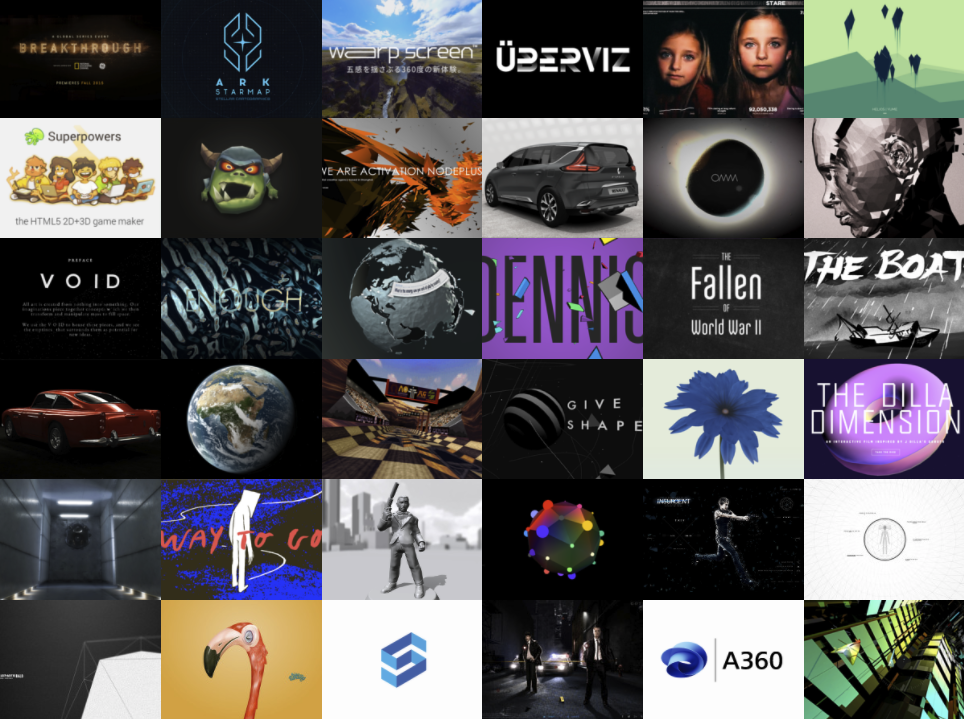

# A \(not so\) brief history

HTML has been around for 30 years, providing building blocks for all browser experiences. 5 years after, JavaScript and CSS came along, improving functionality and aesthetics. Since then, this triad can be found anywhere there is a browser.

With an increase in web sites an explosion of users followed, and we began studying user interface design at an increasing scale \([Designing Web Usability](https://www.nngroup.com/books/designing-web-usability/) and [A List Apart](https://alistapart.com/) anyone…\). We moved away from tables to stylesheets, and learnt terms like [graceful degradation and progressive enhancement](https://www.w3.org/wiki/Graceful_degradation_versus_progressive_enhancement), while swearing at having to write this:

```markup
<!--[if !IE]> -->
<link type="text/css" rel="stylesheet" href="/stylesheets/no-ie.css">
<!-- <![endif]-->
```

2000 and onwards we put web sites aside and made **web systems** giving birth to the blog with Wordpress \(2003\) moving from personal platform to the number one CMS for everyone. _And along came e-commerce and Facebook…_

2007 the smartphone arrived, and suddenly we had to consider touch and all the other inputs that a smartphone had \(sound, video, light, GPS, motion\). This made the browser **become personal**. The revolution of the smartphone made space for [Jquery](https://jquery.org/) and a hurricane of libraries assisting in building engaging interfaces \(and also killing Flash\).

2009 [Node.js](https://nodejs.org/) made an entrance allowing JS to communicate with the operative system and connected devices. JS was now breathing the same air as Python and other programming languages. The cage was unlocked.

2010 [Three.js](https://threejs.org/) is released and [Processing.js](http://processingjs.org/) \(now [p5.js](https://p5js.org/)\) two years prior, enabling beautiful  and interactive experiences in the browser.



2011 [IFTTT](https://ifttt.com/) is launched, demonstrating the huge interest in data driven experiences, and chaining tools. We automate experiences and use API's back and forth. 

_Remember when the Twitter API was completely open? Internet became complicated again with complicated steps of verification \(some which live on today\)._

2013 [React.js](https://reactjs.org/) and [Electron](https://www.electronjs.org/) were released, as a response to keeping web technologies relevant as native applications for mobile and desktop could be made with only one framework. 

As code bases grew, sanity had to be kept. We began working heavily with Git, CSS pre-compilers \([SASS](https://sass-lang.com/)\), task runners and module bundlers \(think [Webpack](https://webpack.js.org/)\). We built [CoffeeScript](https://coffeescript.org/) and later [TypeScript](https://www.typescriptlang.org/), and "vanilla JavaScript" become a search term.

2014 the ESP8266 was released, a low-cost Wi-Fi microchip enabling microcontrollers to gain access to the web. Together with Bluetooth Low Energy everything became connected, and "Internet of \([Enchanted](http://enchantedobjects.com/)\) Things" got cheer leader level popularity. 

_It's not difficult to imagine the rise of the voice assistant following along._

2015 and onward we begun working with push states and service workers, making web sites feel native \(no reload\). This is something we are still looking at today with the surge of Progressive Web Applications \(PWA\), which has led to todays interest in [SVELTE](https://svelte.dev/) and [FLUTTER](https://flutter.dev/). 

2016 [A-Frame](https://aframe.io/) was created in order to allow web developers and designers to author 3D and VR experiences with HTML. Two years later the Oculus Go is released, a VR headset that can view VR experiences in the browser.

2018 [ML5](https://ml5js.org/) simplified the process of using machine learning, and combined with [Teachable Machine](https://teachablemachine.withgoogle.com/) creating your own datasets is a breeze.

A lot more has happened of course, we use [Glitch](http://glitch.com/) for writing collaborative code, published immediately. And instead of dynamic sites we use Static Site Generators such as [11ty](https://www.11ty.dev/) and [Jekyll](https://jekyllrb.com/).

_If web development once was a box of wonders, it has scaled into a universe. Just take a look at this_ [_awesome list_](https://github.com/sindresorhus/awesome) _from_ [_Sindre Sorhus_](https://sindresorhus.com/) _or_ [_Sans Francisco_](https://www.sansfrancis.co/) _collection of tools._

If you are getting started, it can be overwhelming. But what's great is, it's all still HTML, CSS and JavaScript. And on that front, not much has fundamentally changed. **Learn the basics.**

