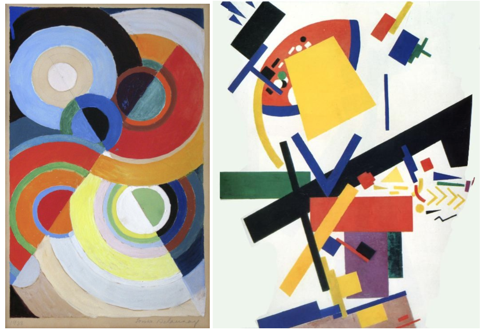

# Processing

Processing has lowered the threshold of programming, and with [The Nature of Code](http://natureofcode.com/), [Generative Gestaltung](http://www.generative-gestaltung.de/2/) and Daniel Shiffman's [The Coding Train](https://www.youtube.com/user/shiffman/videos), getting started couldn't be easier!

### Install

P5 \([link](https://editor.p5js.org/)\) runs in the browser and requires no installation. Create an account to enable saving and sharing. Ask questions in the [Processing Foundation Discourse](https://discourse.processing.org/) and use the [Reference](https://p5js.org/reference/) and [Examples](https://p5js.org/examples/).


It is also possible to code live using [Ted Davis P5 Live](https://teddavis.org/p5live/).


## Generative design

Generative design is the symbiosis between machine and designer, where the designer is likely also the programmer of the machine. A systematic approach to design \(and art\) that is finding its place in art history, with its closest artistic relative — modern art. 

Modern art is broad term, but the consensus of its beginnings is focused on a disruption in representing historical and/or mythological figures, towards the representation of everyday life themes and subjects. 

> Abstract art is art that does not attempt to represent an accurate depiction of a visual reality but instead use shapes, colours, forms and gestural marks to achieve its effect.

In rejecting history and the realistic depiction of subjects, artists also embraced experimentation with form. The freedom in shapes, colours and lines was the fertile ground for abstract art to flourish.

It’s commonly accepted that Kandinsky was the pioneer of abstract art, however the abstract works of Hilma af Klint \(Stockholm 1862-1944\) predate Kandinsky, Malevich and Mondrian for several years. The revelation of Hilma's works was delayed also due to her expressed wishes in will that her works should not shown to the world for 20 years after her death!

A close look to the early abstract works reveals a deliberate use of repetition in form, and sets of rules to help guide the progression of the piece. Thinking in those terms will be the foundation of algorithmic-based art, or generative design. We'll continue by looking how this manifests itself through the aid of machines, and in various kinds of media.

_There are several other artist movements to use as search terms: cubism, expressionism and surrealism to name a few._

### [Will artificial intelligence replace professional cultural creators?](https://strelkamag.com/en/article/lev-manovich-ai-aesthetics)

With modern tools many have been tempted to further understand abstract art, by deconstructing it so much that a machine can follow its rules. Where does the human begin and machine end? In the sixties artists began experimenting, Frieder Nake \([talk](https://www.youtube.com/watch?v=x-qAPvYdXgM)\), a pioneer of computer art created machines which themselves were creators. And Vera Molnár, a few years layer, made her own explorations as to what generative art could be. [Read this fantastic post about her](https://medium.com/@xuetingzhang313/re-code-vera-moln%C3%A1rs-interruptions-b6dc9765eae5).

Modern artists such as [Zach Lieberman](https://www.instagram.com/zach.lieberman/) and [Saskia Freeke](https://www.instagram.com/sasj_nl/) work within the field of [Computer Graphics](https://www.e-flux.com/architecture/becoming-digital/248077/some-notes-on-making-images-with-computers/), and use the freedom that the machine provides, leveraging its power, and iterates every day, as means of artistic expression. [Jan Jarfalk](https://www.instagram.com/janjarfalk/) uses his generative code in combination with an [Axidraw](https://axidraw.com/) writing and drawing machine. For more inspiration, visit [Open Processing](https://www.openprocessing.org/). And, let's end this segment with a bang, with [Yajoi Kusama](https://www.artnews.com/wp-content/uploads/2019/01/kusama-portrait4.jpg).

### Generative design elsewhere

Other fields has fun with machines as well \(of course\). Steve Reichs [Piano Phase](https://www.youtube.com/watch?v=gobDFubBiRg) is a minimalist composition, written in 1967 for two pianos \(or piano and tape\). It is one of his first attempts at applying his "phasing" technique.

Deconstructing and recomposing like this has later evolved into unique languages and cultures, such as the [algorithmic music scene](https://youtu.be/CSQ8npnlk0I), where codified music is written on the spot, creating compositions never heard before.

Together, we will take the first steps into deconstructing the world around us, and rebuilding it with our own hands.

_Let's get started!_

