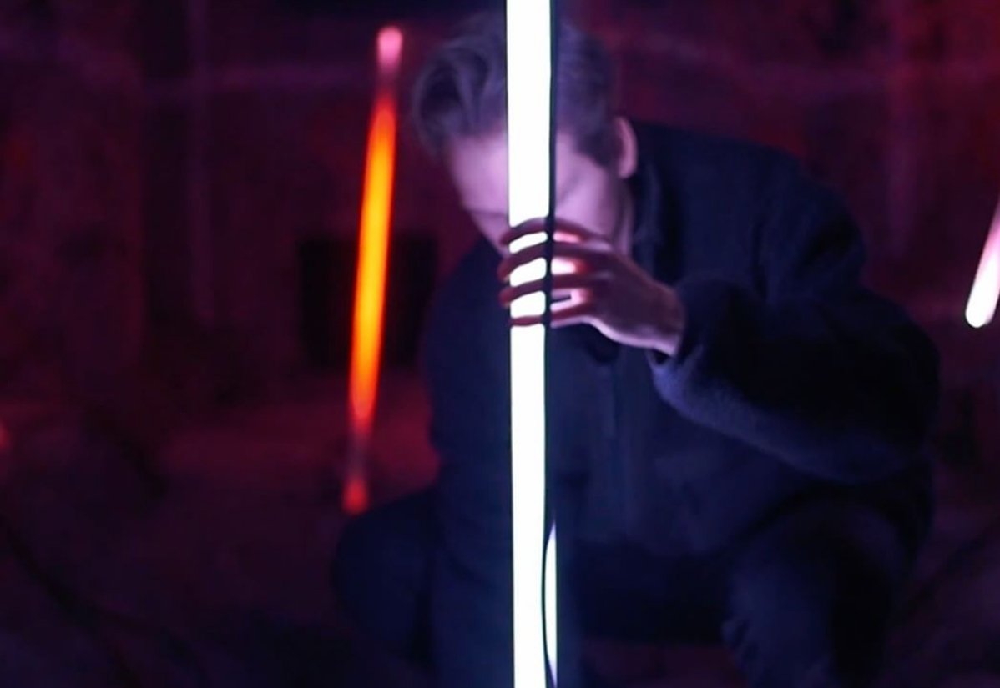

# Team

## Industry Leader

### [Jonas Johansson](https://jonasjohansson.se/)

Anywhere based artist, designer and programmer transforming light + technology through → play, biology and \(un\)human intervention. Hyper alumni and Industry Leader at Hyper Island since 2016.  Part of [Nordic Audiovisual Artists](https://nava.community/) and [Svartljus](https://svartljus.se/).

## Guest speakers

### [Tim Rodenbroeker](https://timrodenbroeker.de/)

The term "Creative Coding" symbolises the link between the arts and experimental software-development. In this intersection an unexplored, fascinating universe comes to life. And it is here that Tim applies his skill and shares his experience.

→ Check out Tim live at the [TEDx UniPaderborn](https://www.youtube.com/watch?v=JW7oAbLVNJE)

### Mattias Petter Johansson \(FunFunFunction\)

The host of FunFunFunction, popular show about programming, Mattias has been around and will join Exploring Code as a guest lecturer on topics that are dear to him.

### [Katarina Ljungdahl](https://earthpeople.se/katarina)

TBD

### [Owen Hindley](http://www.owenhindley.co.uk/)

TBD

### [Alexander Wallin](https://www.alexanderwallin.com/)

TBD

## Class representatives

| Week | Who |
| :--- | :--- |
| 20-24 | [nanda.vandenhoek@hyperisland.se](mailto:nanda.vandenhoek@hyperisland.se) [nadine.ochsner@hyperisland.se](mailto:nadine.ochsner@hyperisland.se) |

