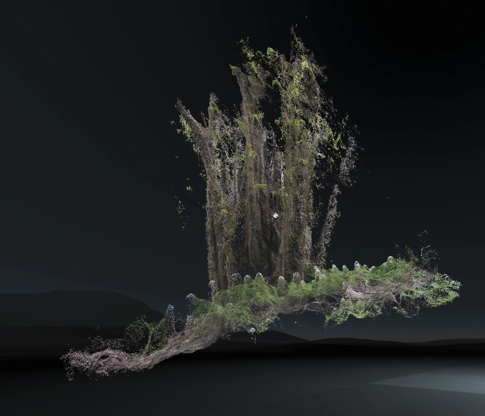

# Display Point Clouds in the Browser

A point cloud is a collection of points in 3D space. A point can be  understood best compared to a pixel in an image, where the pixel has four channels for color RGBA and the point has three channels for position XYZ.



### Install

Download [Metashape](https://www.agisoft.com/) and [CloudCompare](https://cloudcompare.org/).

### Import

#### Video

Go to `File > Import > Import Video…` and select the video file. When asked, create a folder for the extracted frames.

#### Image

Go to `Workflow > Add Folder…` or `Workflow > Add Images…`

### Workflow

The following steps will process the images and create a textured mesh.

1. Go to `Workflow > Align Photos…` and choose Medium accuracy to save time.
2. Once loaded, go to `Workflow > Align Photos…`and choose Medium quality.
3. `Workflow > Build Dense Cloud…`
4. `Workflow > Build Mesh…`
5. `Workflow > Build Texture…`
6. `File > Export > Export model…`
7. Import the model in CloudCompare and `Edit > Mesh > Sample Points` to generate a point cloud.
8. Select the sampled mesh and save as PLY \(binary\)

### Demo



```markup
<html>
  <head>
    <script src="https://threejs.org/build/three.js"></script>
    <script src="https://threejs.org/examples/js/loaders/PLYLoader.js"></script>
  </head>
  <body style="margin: 0;">
    <script>
      var scene = new THREE.Scene();

      var camera = new THREE.PerspectiveCamera(45, window.innerWidth / window.innerHeight, 0.1, 10000);

      var renderer = new THREE.WebGLRenderer();
      renderer.setPixelRatio(window.devicePixelRatio);
      renderer.setSize(window.innerWidth, window.innerHeight);

      document.body.appendChild(renderer.domElement);

      var loader = new THREE.PLYLoader();
      loader.load('YOUR_PLY', function (obj) {
        var model = new THREE.Points(
          obj,
          new THREE.MeshBasicMaterial({
            vertexColors: THREE.VertexColors
          })
        );
        scene.add(model);
        animate();
      });

      function animate() {
        requestAnimationFrame(animate);
        render();
      }

      function render() {
        renderer.render(scene, camera);
      }
    </script>
  </body>
</html>
```



```markup
<html>
  <head>
    <script src="https://unpkg.com/aframe@latest"></script>
    <script src="https://unpkg.com/aframe-pointcloud-component/dist/aframe-pointcloud-component.min.js"></script>
  </head>
  <body>
    <a-scene background="color: black">
      <a-pointcloud src="url(YOUR_PLY)" size="0.01">
      </a-pointcloud>
    </a-scene>
  </body>
</html>

```



```markup
<html>
  <head>
    <script src="https://threejs.org/build/three.js"></script>
  </head>
  <body style="margin: 0;">
    <script src="script.js"></script>
    <script>
      var scene = new THREE.Scene();
      
      var camera = new THREE.PerspectiveCamera(
        45,
        window.innerWidth / window.innerHeight,
        1,
        10000
      );
      camera.position.set(0, 0, 1000);

      new THREE.TextureLoader().load("https://images.unsplash.com/photo-1588117472013-59bb13edafec?ixlib=rb-1.2.1&auto=format&fit=crop&w=934&q=80", tex => {
        let img = tex.image;
        var width = img.width;
        var height = img.height;
        var depth = 70;
        var canvas = document.createElement("canvas");
        canvas.width = width;
        canvas.height = height;
        var ctx = canvas.getContext("2d");
        ctx.drawImage(img, 0, 0);
        var imageData = ctx.getImageData(0, 0, width, height);
        var data = imageData.data;
        document.body.appendChild(canvas);

        var geometry = new THREE.BufferGeometry();
        var positions = [];

        var color = new THREE.Color();
        var colors = [];

        var index = 0;

        for (var y = 0; y < height; y++) {
          for (var x = 0; x < width; x++) {
            const r = imageData.data[index + 0] / 255;
            const g = imageData.data[index + 1] / 255;
            const b = imageData.data[index + 2] / 255;
            const brightness = brightnessByColor(r, g, b);
            var z = map(brightness, 0, 1, -depth, depth);
            color.setRGB(r, g, b);
            colors.push(color.r, color.g, color.b);
            positions.push(x - height / 2, -y + width / 2, z);
            index += 4;
          }
        }

        geometry.setAttribute(
          "position",
          new THREE.Float32BufferAttribute(positions, 3)
        );

        geometry.setAttribute(
          "color",
          new THREE.Float32BufferAttribute(colors, 3)
        );

        geometry.computeBoundingSphere();

        var material = new THREE.PointsMaterial({
          size: 1,
          vertexColors: true,
          sizeAttenuation: false
        });
        
        points = new THREE.Points(geometry, material);
        scene.add(points);

        animate();
      });

      var renderer = new THREE.WebGLRenderer();
      renderer.setPixelRatio(window.devicePixelRatio);
      renderer.setSize(window.innerWidth, window.innerHeight);

      document.body.appendChild(renderer.domElement);

      function animate() {
        requestAnimationFrame(animate);
        render();
      }

      function render() {
        renderer.render(scene, camera);
      }
    </script>
  </body>
</html>

```



