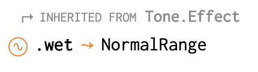

# 6. Effects ✨

Effects are to music what sauce is to food; you can do without it, bad damn does it hot things up.

Here's how you create a delay effect using [`Tone.FeedbackDelay`](https://tonejs.github.io/docs/13.8.25/FeedbackDelay):

```javascript
const delay = new Tone.FeedbackDelay({
  delayTime: 0.4, // seconds
  feedback: 0.5,
  wet: 0.3,
})
```


All effects in Tone.js have a `wet` property that dictates the balance between the raw incoming audio and the effect. A value of `0` means you won't hear it at all, and `1` means you here only the effect.


In addition to specifying parameters in the options object, you can set them elsewhere using one of two ways:

```javascript
// For properties that are regular types like
// numbers or strings
effect.prop = 123

// For properties that are so called Signals:
effect.prop.value = 123
```

If the property has an icon with a sine wave in it, you know it's a [Signal](https://github.com/Tonejs/Tone.js/wiki/Signals).



To apply this delay to a `player`, you `.connect()` the `player` to the `delay` and then the `delay` to `Tone.Master`.

```javascript
player.connect(delay)
delay.connect(Tone.Master)
```

Or, if you're lazy \(which is sometimes a good trait in a developer\):

```javascript
player.chain(delay, Tone.Master)
```

Let's play a short percussive sound with a delay effect!

```javascript
let player

function setup() {
  createCanvas(window.innerWidth, window.innerHeight)
  
  Tone.Master.volume.value = -24 // decibels

  player = new Tone.Player({
    url: 'https://www.alexanderwallin.com/audio/percussion-tamborim.ogg',
  })

  const delay = new Tone.FeedbackDelay({
    delayTime: 0.4,
    feedback: 0.5,
    wet: 0.3,
  })
  player.chain(delay, Tone.Master)
}

function mouseClicked() {
  if (!player.loaded) {
    return
  }
  player.restart()
}
```


Try swapping out the `Tone.FeedbackDelay` for a [`Tone.PingPongDelay`](https://tonejs.github.io/docs/13.8.25/PingPongDelay) to hear a different kind of delay.


Now how about some reverb? The mother of all effects. Replace line 17 with the following:

```javascript
const reverb = new Tone.Reverb({
  decay: 10, // seconds
  wet: 0.75,
})
// This is required to get the reverb working.
// It's mentioned in the Tone.Reverb docs page
// description.
reverb.generate()
player.chain(delay, reverb, Tone.Master)
```

and you shall here the smooth and silky touch of reverb. It's starting to sound like music, isn't it?


