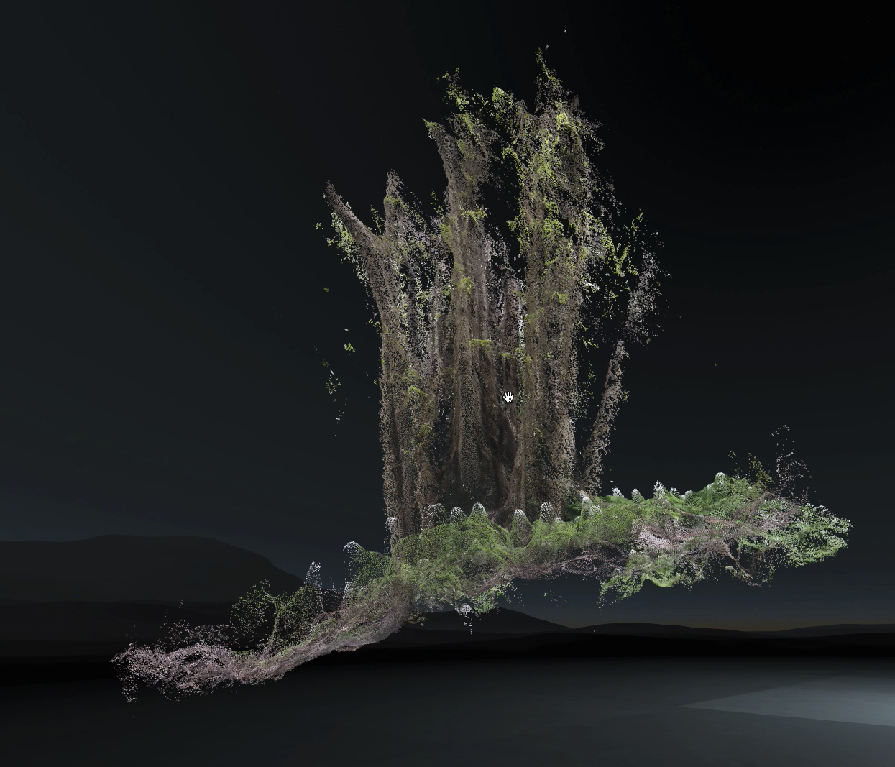

# Display Point Clouds in the Browser

A point cloud is a collection of points in 3D space. A point can be  understood best compared to a pixel in an image, where the pixel has four channels for color RGBA and the point has three channels for position XYZ.

### Install

Download [Metashape](https://www.agisoft.com/) and [CloudCompare](https://cloudcompare.org/).

### Import

#### Video

Go to `File > Import > Import Video…` and select the video file. When asked, create a folder for the extracted frames.

#### Image

Create a folder for all the image frames, and drag and drop the folder.

### Workflow

The following steps will process the images and create a textured mesh.

1. Go to `Workflow > Align Photos…` and choose Medium accuracy to save time.
2. Once loaded, go to `Workflow > Align Photos…`and choose Medium quality.
3. `Workflow > Build Dense Cloud…`
4. `Workflow > Build Mesh…`
5. `Workflow > Build Texture…`
6. `File > Export > Export model…`
7. Import the model in CloudCompare and `Edit > Mesh > Sample Points` to generate a point cloud.
8. Select the sampled mesh and save as PLY \(binary\)

### Demo



```markup
<html>
  <head>
    <script src="https://threejs.org/build/three.js"></script>
    <script src="https://threejs.org/examples/js/loaders/PLYLoader.js"></script>
  </head>
  <body style="margin: 0;">
    <script>
      var renderer, scene, camera;

      scene = new THREE.Scene();

      camera = new THREE.PerspectiveCamera(45, window.innerWidth / window.innerHeight, 0.1, 10000);

      renderer = new THREE.WebGLRenderer();
      renderer.setPixelRatio(window.devicePixelRatio);
      renderer.setSize(window.innerWidth, window.innerHeight);

      document.body.appendChild(renderer.domElement);

      var loader = new THREE.PLYLoader();
      loader.load('YOUR_PLY', function (obj) {
        var model = new THREE.Points(
          obj,
          new THREE.MeshBasicMaterial({
            vertexColors: THREE.VertexColors
          })
        );
        scene.add(model);
        animate();
      });

      function animate() {
        requestAnimationFrame(animate);
        render();
      }

      function render() {
        renderer.render(scene, camera);
      }
    </script>
  </body>
</html>
```



```markup
<html>
  <head>
    <script src="https://unpkg.com/aframe@latest"></script>
    <script src="https://unpkg.com/aframe-pointcloud-component/dist/aframe-pointcloud-component.min.js"></script>
  </head>
  <body>
    <a-scene background="color: black">
      <a-pointcloud src="url(YOUR_PLY)" size="0.01">
      </a-pointcloud>
    </a-scene>
  </body>
</html>

```





