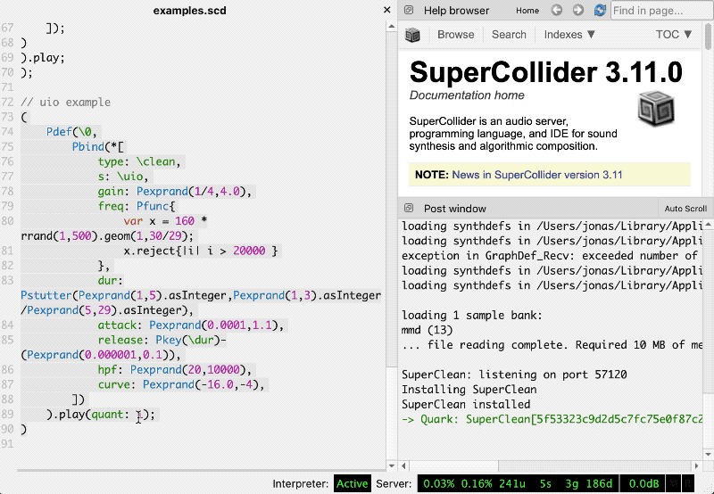

# Running SuperClean in SuperCollider


Written by [Daniel M Karlsson](http://danielmkarlsson.com/) and edited by [Jonas Johansson](https://jonasjohansson.se/)


### Install

Download [SuperCollider](https://supercollider.github.io/download) and drag the extracted folder into Applications.

#### Installing SuperClean

1. Open SuperCollider
2. Copy `Quarks.install("https://github.com/danielmkarlsson/SuperClean.git");` and paste in the Untitled window.
3. With the cursor on the same line press `⌘ + Enter` to install SuperClean.

#### Installing Sc3plugins

1. Download [Sc3plugins](https://supercollider.github.io/sc3-plugins/)
2. With SuperCollider open, go to `File > Open user support directory`
3. Grab the downloaded folder `sc3plugins` and drag it to the `Extensions` folder

#### Create Startup script

1. Go to `downloaded-quarks` \(one step up\) and open `superclean_startup.scd` and copy its contents.
2. Go to `File > Open startup file`, and paste here.
3. Save the file and reboot SuperCollider.

### Play

1. Open `examples.scd` and wait for the message `SuperClean: Listening on port 57120` in the Post window.
2. Go to line 90 and press `⌘ + Enter` to listen! 
3. Press `⌘ + .` to stop \(but why would you want to?\).

