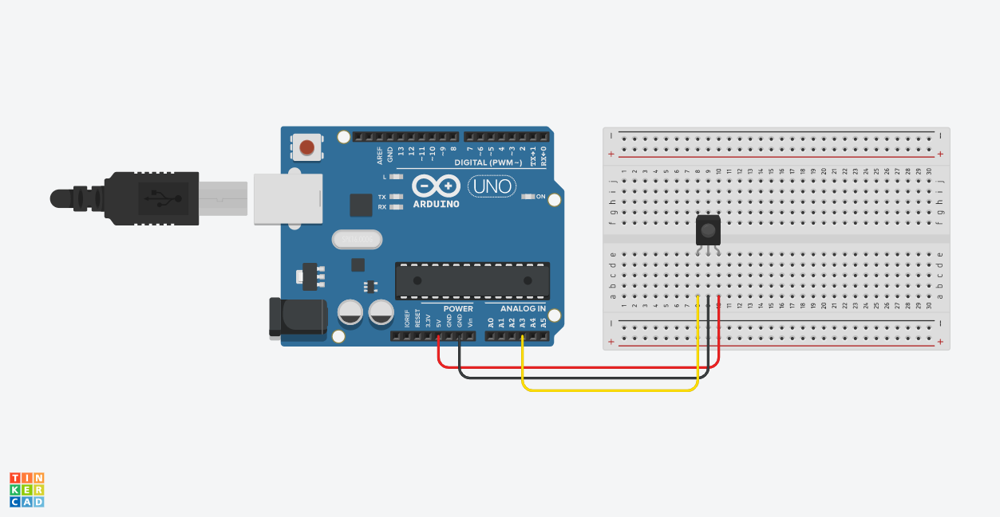

# Input

## Sound

### [Electret Microphone Amplifier](https://learn.adafruit.com/adafruit-agc-electret-microphone-amplifier-max9814)​



With the Microphone amplifier you can take the microphone signal and feed it into a regular audio jack, or [measure the sound levels](https://learn.adafruit.com/adafruit-microphone-amplifier-breakout/measuring-sound-levels) with the Arduino. 


Make all gain adjustments gently. If you feel resistance, stop. The tiny trim pot is delicate and it is easy to damage by turning past the stop.






| Sensor pin | Arduino pin |
| :--- | :--- |
| OUT | A0 |
| GND | GND |
| VCC | 5V |



```cpp
void setup() {
  Serial.begin(9600);
}

void loop() {
  double volts = getVolume(50);
  Serial.println(volts);
}

double getVolume(int sampleWindow) {
  unsigned long startMillis = millis();
  unsigned int peakToPeak = 0;
  unsigned int signalMax = 0;
  unsigned int signalMin = 1024;

  while (millis() - startMillis < sampleWindow) {
    unsigned int sample = analogRead(0);
    if (sample < 1024) {
      if (sample > signalMax) {
        signalMax = sample;
      } else if (sample < signalMin) {
        signalMin = sample;
      }
    }
  }

  peakToPeak = signalMax - signalMin;
  double volts = (peakToPeak * 5.0) / 1024;
  return volts;
}
```



## Motion

### ​[ADXL326 Triple-Axis Accelerometer](https://www.adafruit.com/product/1018)



An accelerometer can measure how its rotated \(its orientation\), along three different axes. Each axis has its own pin which gives an analog signal between 0 to 5 volts. The Arduino can measure these values with its Analog In ports.



We have these units from Sparkfun and from Adafruit, both work the same way but look slightly different. 



The values might come out a bit noisy, this can be fixed by [smoothing the values](https://www.arduino.cc/en/tutorial/smoothing).




| Sensor | Arduino |
| :--- | :--- |
| Vin / VCC | 5V |
| GND | GND |
| Zout | A0 / A5 |
| Yout | A0 / A5 |
| Xout | A0 / A5 |



```cpp
void setup() {

}

void loop() {
  int valx = analogRead(0);
  int valy = analogRead(1);
  int valz = analogRead(2);

  Serial.print(valx);
  Serial.print(" ");

  Serial.print(valy);
  Serial.print(" ");

  Serial.print(valz);
  Serial.println(" ");
}
```



## Force

All of these work the same way as a light sensor, see [Arduino basics](../basics.md#photocell)

### [Force Sensitive Resistor \(FSR\)](https://www.adafruit.com/product/1075)


### [Flex Sensors](https://www.adafruit.com/products/182)


## Proximity

### [Sharp Distance Sensor](https://www.adafruit.com/product/164)







| Sensor pin | Arduino pin |
| :--- | :--- |
| Black wire | GND |
| Red wire | 5V |
| Yellow/white wire | A3 |





```cpp
void setup() {
  Serial.begin(9600);
}

void loop() {
  int val = analogRead(A3);
  // convert sensor reading into 0-255
  // change 0-600 to whatever fits your sensor
  int mappedVal = map(val,0,600,0,255);
  Serial.print(val);
  Serial.print("\t");
  Serial.println(val);
}
```



### [Maxbotix Ultrasonic Rangefinder](https://www.adafruit.com/product/172)







| Sensor pin | Arduino pin |
| :--- | :--- |
| GND | GND |
| V+ | 5V |
| 3 | A0 |



```cpp
void setup() {
  Serial.begin(9600);
}

void loop() {
  int distsensor = checkDistanceSensor();
  
  Serial.print(F("Sensor = ")); 
  Serial.println(distsensor);
  
  // add your code to use the distensor value here
}

int checkDistanceSensor() {
  int distsensor, i;
  long time;
  distsensor = 0;
  for (i = 0; i < 8; i++) {
    distsensor += analogRead(0);
    delay(50);
  }
  distsensor /= 8;
  return distsensor;
}

```



### [Parallax Wide Angle PIR](https://www.adafruit.com/product/189)







