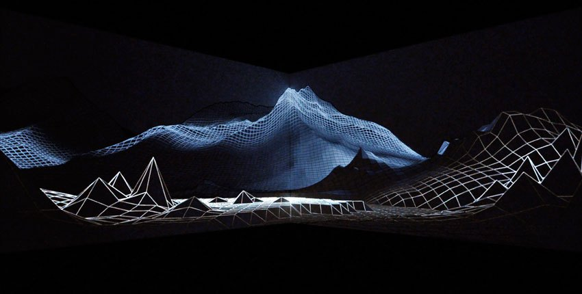
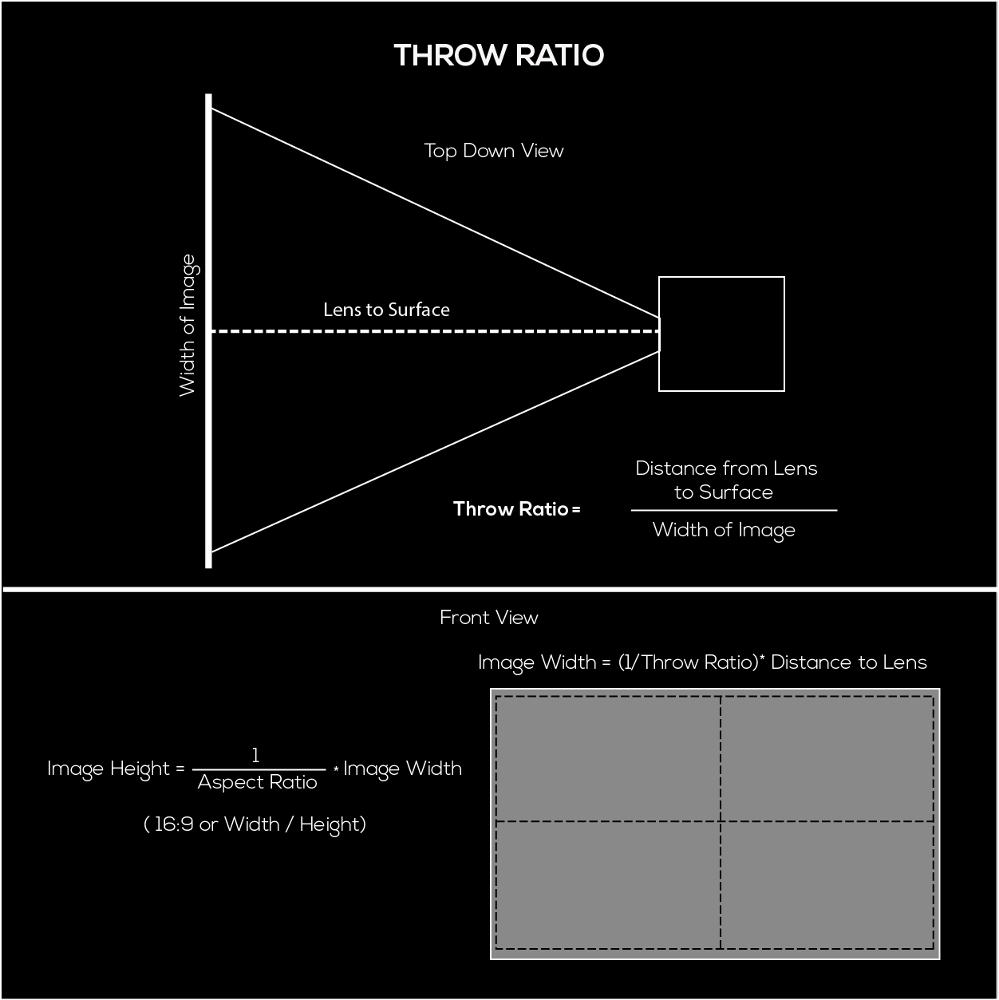
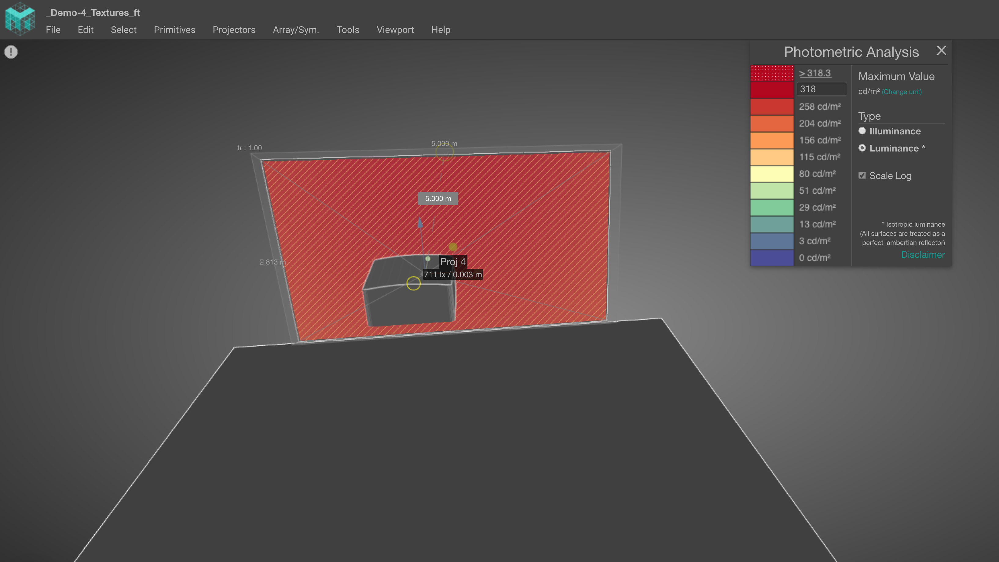

# Specifications

## Resolution

This is a term that we are fully aware today,  we see it from our computer screens, phones and tv and projectors are not any different.

This is the actual maximum resolution the projector is capable of displaying. You can send it higher resolutions than this, but the physical number of pixels will remain the same. If it's native resolution is 1280x720 and you send it 1920x1080p, there is just going to be down sampling to match native resolution. If you see the spec "Supported Resolutions" - Warning! This spec is nearly useless and incredibly misleading. Only pay attention to the native resolution if you want the physical pixel count. Supported resolutions just means the resolutions that the projector is capable of accepting and then down sampling or up sampling to match its native resolution. 

it is very common now to see projectors that "support" 4K resolution but this is only a marketing strategy, because the real native resolution is 1920 x1080p . But what they are doing is using pixel shift. 

> Shifting the red and blue sensors half a pixel in both the vertical and horizontal direction permits the recovery of a 1920 × 1080 luminance signal. This technique is seeing a renaissance with native 1080p video **projectors** that **pixel shift** horizontally to produce an effectively 4K image on the screen."

So to make it simpler to understand, those 4K pixels are not coming out the lens, only 1920x1080p.

## Lumens

This spec is somewhat standardized with ANSI units, but different manufacturers can waver a bit. A difference of a couple hundred lumens between projectors isn't much to consider if you need something slightly brighter, it's easier to think in 1000 lumen increments generally. Also, as a guidance, you'll want at minimum around 215 lumens per square meter of image.  Below I will explain how you calculate the brightness.

Lumens generally is one of the most important features in a projector and with higher lumens you can over come ambience lighting.

## **Contrast Ratio**

his non-standardized misleading unit used by the manufactures.

Contrast ratio in its simplest form is the ratio of the light reflected from an all white image and an all black image. So a projector with a 3000:1 contrast ratio means that the white image is 3000 times brighter than the black image. The higher the contrast ratio, the more detail you can see on the projected image whether it is numbers, pictures, graphs, text, or video. Contrast is what makes it possible for us to see the subtle shades of colors. 

So good contrast is all about seeing the details 3000:1 contrast ratio is poorer than 10,000:1 but companies use different ways to quantify their contrast, so it can be very hard to gauge what the reality is until you get one. Some projectors also have dynamic contrast which means that they automatically adjust their lens to provide darker blacks depending on the image that is coming through

As you can see in the picture above a good contrast ratio is an important feature to achieve deeper blacks and bright whites.

## **Throw ratio**

This is probably the second most important specification behind lumens. This value gives you the ratio of the width of the projected image to the distance from the surface. If we know the throw ratio we can calculate where to place the projectors .For example, a throw ratio of 1:1 means that for every 1meter away from the wall, you will get 1meter of image width \(and your height is determined by the aspect ratio\). Lens zoom is also a related property because it allows you a small "variable" lens shift.

## **Lens Shift**

Lens shift is generally only available on higher end projectors. Most projectors have a slight lens offset that allows them to be below or above their screen and still have a square image.  Lens shift allows you to correct for this offset if necessary . Do not confuse lens shift with just tilting the projector, if you tilt the projector  would result in more key-stoning. Some projectors have manual or motorized lens shift and this depends on the price range of the projector. 

Having the freedom of controlling the lens shift will let you to worry less about exact placement of your projector because you will be able to shift the light beam around.

Most of the time I like to do the throw ratio calculation myself, but if you are not like me you could find plenty of website or apps that does that.  [Projector calculator](https://www.projectorcentral.com/projection-calculator-pro.cfm) and [iOS app](https://apps.apple.com/us/app/projectorpro/id542534287) , also most of the projector manufactures has their own online projector calculator.

Manufactures numbers can be a little bit off,  or you may need to shift the placement few centimeters. So it is always good to  have an extra +/- 5% of image could be really helpful.

## Brightness 

Our primary concern is our lumens per square meter ratio, as this is the value that really changes the final output. This is just calculated as: **Total Lumens / Area of projection** 

$$
3000 Lumens / 6m² = 500 lumes/m²
$$

You want to stay above a minimum value of around 215lumens/m².  If you go  below that value, you run the risk of your brightness and contrast being so weak that your image is washed out or unacceptably dim in less than ideal conditions.

There are many factors that can alter the eye's perception this calculated value including:

* Screen type /Screen gain - reflectivity of the screen
* Surface type / Material
* Ambient light 

Your type of surface can also affect your total brightness and contrast. Walls, screens, building exteriors, scrims, front or rear are all decisions that carry their own potential issues. Avoid really dark surfaces at all costs, as they absorb much of your photons and don't reflect as many. However, in some situations gray screens are preferable over white screens because the gray can absorb more of the ambient light and improve contrast.


If you want to read more about brightness, materials and screen gain here is and important reading.

[http://www.projectorcentral.com/home\_theater\_projector\_buyers\_guide.htm?page=Brightness](http://www.projectorcentral.com/home_theater_projector_buyers_guide.htm?page=Brightness)

[http://www.projectorcentral.com/white\_gray\_projection\_screens.htm](http://www.projectorcentral.com/white_gray_projection_screens.htm)

[http://www.projectorcentral.com/projector\_screens\_gain.htm](http://www.projectorcentral.com/projector_screens_gain.htm)


