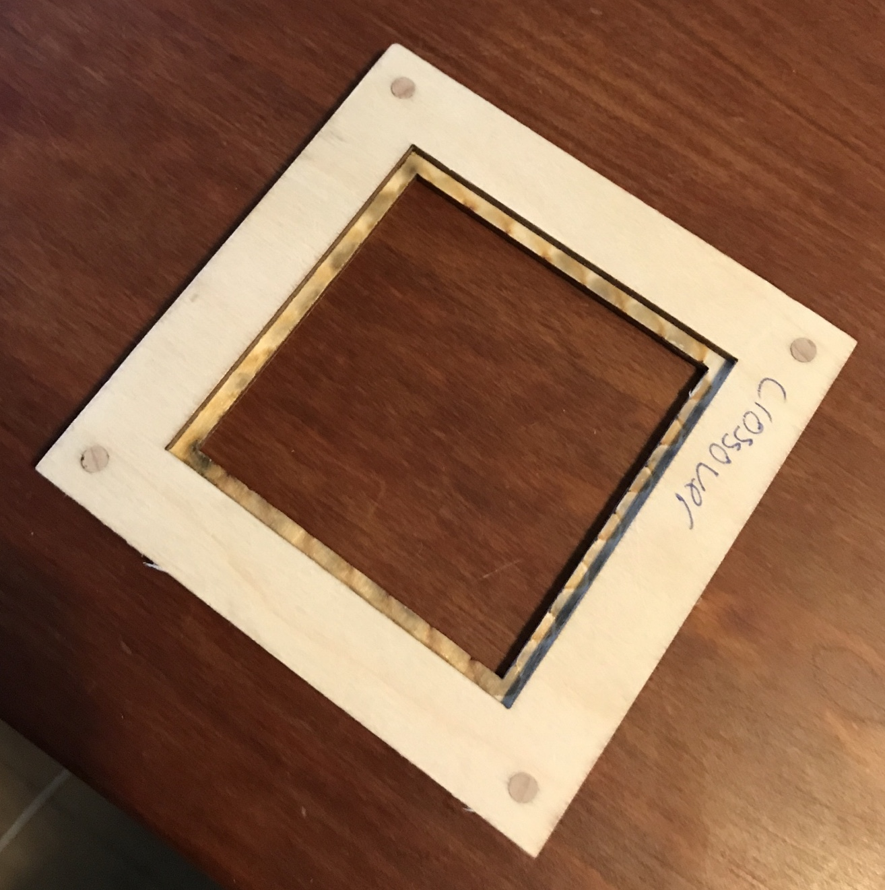
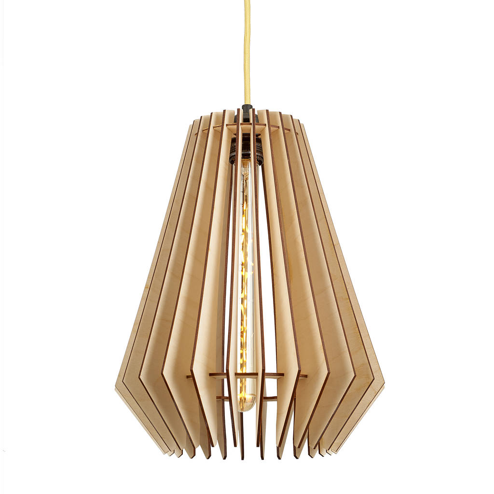
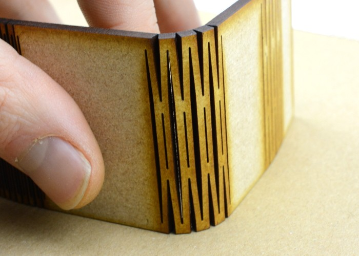
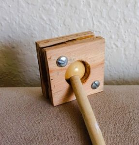
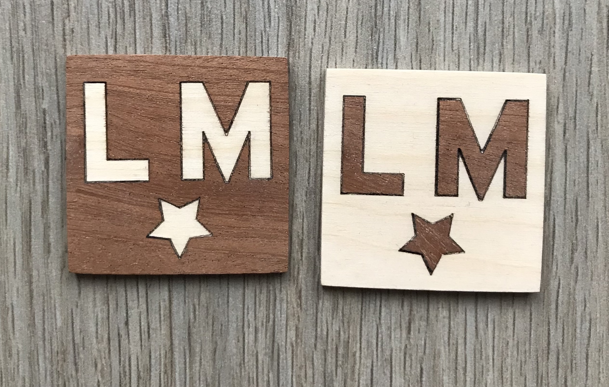

# Advanced

## Stacking

This is a simple technique to layer cuts to make larger objects. Since the laser tube is 40W, you can't really cut through an 18mm piece of wood, but you totally could cut through six 3mm pieces of wood and stack them for the same result. If you want to perfectly align them for gluing, you could put a pair of alignment holes in each piece and align them with dowel pins. This also helps to hold the pieces together without clamps. As seen the the photo below, all the layers don't need to be exactly the same and can be aligned if they all have the same alignment holes.

## 3D-2D using Slicer

This is an amazing tool for rapidly creating laser plans from 3D files. It takes a .stl file or similar and converts it into flat shapes which you can cut and assemble. If you are looking for something more complicated than a box, this is a great starting point. There are tons and tons of different options in the slicer, from solid \(like the cat below\), to more structural ones like the lampshade. This is the super version of the above technique, able to automatically generate a lot of things that would take a very long time to design yourself. Highly highly recommended.

[Link](https://apps.autodesk.com/FUSION/en/Detail/Index?id=8699194120463301363&os=Win64&appLang=en)

## Kerf bending

This is a way to make a solid piece of wood flexible. By cutting a pattern of lines on one side of the material, you can create round and curved shapes. This is very similar to living hinges, but keeps one side of the material clean. Same as living hinges, this works best with MDF, but can also work with other materials.

## Living Hinges

This is another way to draw a pattern in such a way to be able to fold wood. It is kind of magic and gets used a lot in laser projects, but it still can be useful in cases where you want to make curves out of one piece of material. Some materials do this really well \(MDF\) and some do not \(acrylic\). This is also possible to make the material fold in more than one direction, but don't expect miracles. If this is something that will bend back and forth over time, it will eventually get weaker and break, so keep that in mind. A good rule of thumb is the bigger the piece, the easier it is to fold.

[Link](https://www.ponoko.com/blog/how-to-make/how-to-design-a-living-hinge/)

### Ball joints

A very simple way to get motion into your projects. There are a couple good designs and ways of doing this. The first image below has a limited range of motion, but the second one can move in more directions. 

### Marqueterie

This is a very old woodworking technique, originally done by hand over a very long period of time. Since we are modern people, we can now give our work to robots and save lots of time. This is a simple technique of cutting a shape out of one piece of material and inserting another material into that hole. This is really easy to do in Illustrator by offseting your strokes a tiny bit. Obviously this is easier to do with larger pieces, but it still works pretty well with tiny things too.

