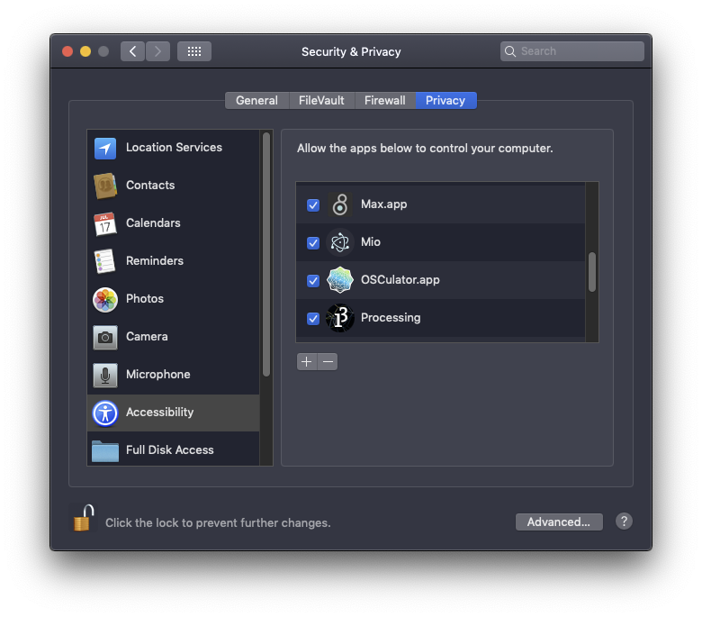

# Keyboard & MIDI

The Arduino Uno is not recognised as a HID \(keyboard, mouse\) which disables the functionality of being able to trigger keyboard presses or mouse movements. To use the Arduino Uno as a keyboard there are two options; running a custom software listening to the serial communication, and flashing the controller with keyboard enabled firmware.

## [Mio](https://jonasjohansson.itch.io/mio)

Mio simplifies serial communication as a trigger for key presses and MIDI communication. It relies on specific commands and values being sent from a device over a serial line. The command and value will then be parsed, leaving only the value.


Because Mio is made by an Unidentified Developer \(me\) the Control key must be pressed while clicking the app icon. Then choose **Open** from the menu.


There are two ways of working with Mio; simple and advanced. Both modes are active.



In the **simple mode** all key logic is handled in Arduino using special commands made by symbols followed by keyboard keys. These commands are **printed** using `Serial.println()` and should in theory be simple and fun! The symbols in use are **dollar sign and exclamation mark;** pressing and releasing the keys.

```csharp
void setup() {
  Serial.begin(9600);
  pinMode(2, INPUT_PULLUP);
  pinMode(3, INPUT_PULLUP);
}

void loop() { 
  int btn1 = !digitalRead(2);
  int btn2 = !digitalRead(3);
  
  if (btn1 == HIGH){
    Serial.println("$space"); // $ presses the space key
  } else {
    Serial.println("!space"); // ! releases the space key
  }
  
  if (btn2 == HIGH){
    Serial.println("$$x"); // $$ presses and holds the x key
  } else {
    Serial.println("!!x"); // !! releases the pressed and held held x key
  }
}
```



In the **advanced mode** most of the logic is managed in Arduino, but some additional functions are only available within the Mio window, such as modifier keys and overseeing Midi communication.

```cpp
void setup() {
  Serial.begin(9600);
  pinMode(2, INPUT_PULLUP);
  pinMode(3, INPUT_PULLUP);
  pinMode(4, INPUT_PULLUP);
}

void loop() {
  int btn1 = !digitalRead(2);
  int btn2 = !digitalRead(3);
  int btn3 = !digitalRead(4);
  
  Serial.println("d2"+String(btn1));
  Serial.println("d3"+String(btn2));
  Serial.println("d4"+String(btn3));
}
```



### Permission

In order to control the keyboard Mio requires permissions. On Mac go to System preferences &gt; Security & Privacy, unlock the page by clicking the lock and providing the password, and then under Accessibility find Mio and tick the box. If a new version has been installed, this might have to be done again!



## Midi

Combining Arduino with MIDI is a popular route for creating interactive audio objects, and there has been much work enabling the process, let's try it!

### Hairless MIDI

1. Install [Hairless MIDI](https://projectgus.github.io/hairless-midiserial/#downloads)
2. Open Audio MIDI Setup
   1. Double-click "IAC Driver"
   2. Toggle "Device is Online"
3. Open Ableton Live
   1. Open Preferences &gt; MIDI
   2. Toggle Track, Sync and Remote for IAC Driver on Input
4. Open Arduino
   1. Open Sketch &gt; Include Library
   2. Change Type to Contributed and Topic to Communication
   3. Search for "MIDI Library" and install the latest version

To include the MIDI library in the Arduino sketch use the following code:

```cpp
#include <MIDI.h>
MIDI_CREATE_DEFAULT_INSTANCE();

void setup() {
  MIDI.begin(MIDI_CHANNEL_OMNI);
  Serial.begin(115200);
}

void loop() {
  MIDI.sendNoteOn(42, 127, 1);
}
```

## Keyboard

### Serial to keypress

1. Install [Node.js 11.15.0](https://nodejs.org/download/release/v11.15.0/) \([Mac](https://nodejs.org/download/release/v11.15.0/node-v11.15.0.pkg)\)
2. Download and unzip [this package](https://github.com/jonasjohansson/anyino).
3. Open Terminal \(⌘+Space and type Terminal\) and type `cd` followed by a space. Then, drag and drop the "serial-keyboard" onto the terminal window and press Enter.
   1. Type `sudo xcode-select --install` and press Enter \(you will be asked for your password\)
   2. When installed, type `sudo npm install` and press Enter
   3. Type `node main.js`
4. Run the following Arduino code:


```cpp
void setup() {
  Serial.begin(9600);
}

void loop() {
  // trigger a key
  // type $ followed by the name of the key
  Serial.println("$up"); // this triggers the up-key
  delay(500);
  // in order to trigger it again, it must be "un-triggered"
  // type ! followed by the name of the key
  Serial.println("!up");
  delay(500);
}
```



It's not possible to have the Serial Monitor running at the same time as the script. Either close the monitor, or close the script. The script can be closed by focusing the terminal window and pressing Ctrl+C.


To map keys to MIDI within Ableton Live use [this guide](https://docs.google.com/presentation/d/1xjRhla6aTVtzeQlrOa1kbYAJJDvl3UsJot2TUJzc7BY/edit#slide=id.g707c928d06_0_63) by Francesco Torelli.



### Flashing firmware

1. [https://www.arduino.cc/en/Hacking/DFUProgramming8U2](https://www.arduino.cc/en/Hacking/DFUProgramming8U2)
2. [https://github.com/BlitzCityDIY/arduinoMacroKeyboard](https://github.com/BlitzCityDIY/arduinoMacroKeyboard)

`sudo dfu-programmer atmega16u2 erase  
sudo dfu-programmer atmega16u2 flash --debug 1 Arduino-keyboard-0.3.hex  
sudo dfu-programmer atmega16u2 reset`

`sudo dfu-programmer atmega16u2 erase  
sudo dfu-programmer atmega16u2 flash --debug 1 Arduino-usbserial-uno.hex  
sudo dfu-programmer atmega16u2 reset`

