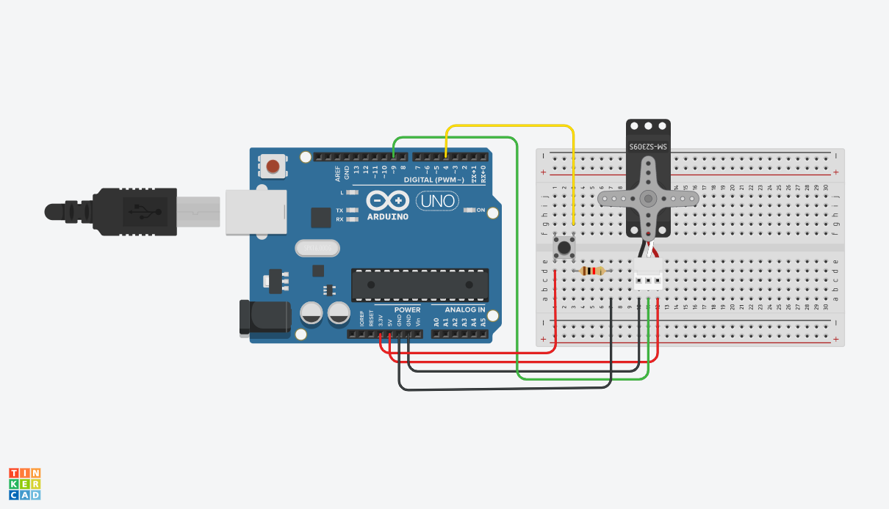

# Motors

### Servo

There are two distinctly different types of servo motors; those that spin 60-80 degrees in each direction, and those that can spin continuously in both directions. It's difficult to know the type just by looking, so you can try to spin the top with your fingers. A full turn mean it's continuous.








```csharp
#include <Servo.h>

Servo myservo;
int pos = 0;

void setup() {
  myservo.attach(9);
}

void loop() {
  for (pos = 0; pos <= 180; pos += 1) {
    myservo.write(pos);
    delay(15);
  }
  for (pos = 180; pos >= 0; pos -= 1) {
    myservo.write(pos);
    delay(15);
  }
}
```



```csharp
#include <Servo.h>

Servo myservo;

int potpin = 0;
int val;

void setup() {
  myservo.attach(9);
}

void loop() {
  val = analogRead(potpin);
  val = map(val, 0, 1023, 0, 180);
  myservo.write(val);
  delay(15);
}
```



### Servo + Button







```csharp
#include <Servo.h>

Servo myservo;
int buttonPin = 4;

void setup() {
  myservo.attach(9);
  pinMode(buttonPin, INPUT);
}

void loop() {
  int buttonState = digitalRead(buttonPin);
  
  if (buttonState == HIGH){
    myservo.write(180);
  } else {
    myservo.write(0);
  }
}
```



### Servo + Potentiometer







```csharp
#include <Servo.h>

Servo myservo;

int val;

void setup() {
  myservo.attach(9);
}

void loop() {
  val = analogRead(5);
  val = map(val, 0, 1023, 0, 180);
  myservo.write(val); 
  delay(15);
}
```



