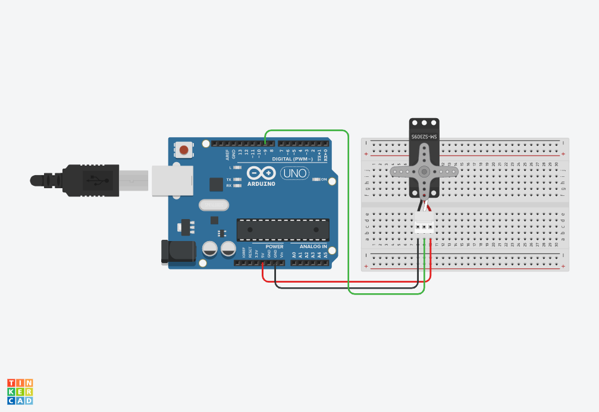

# Motors

### Servo







```csharp
#include <Servo.h>

Servo myservo;
int pos = 0;

void setup() {
  myservo.attach(9);
}

void loop() {
  for (pos = 0; pos <= 180; pos += 1) {
    myservo.write(pos);
    delay(15);
  }
  for (pos = 180; pos >= 0; pos -= 1) {
    myservo.write(pos);
    delay(15);
  }
}
```



```csharp
#include <Servo.h>

Servo myservo;

int potpin = 0;
int val;

void setup() {
  myservo.attach(9);
}

void loop() {
  val = analogRead(potpin);
  val = map(val, 0, 1023, 0, 180);
  myservo.write(val);
  delay(15);
}
```



### Servo + Button







```csharp
#include <Servo.h>

Servo myservo;
int buttonPin = 4;

void setup() {
  myservo.attach(9);
  pinMode(buttonPin, INPUT);
}

void loop() {
  int buttonState = digitalRead(buttonPin);
  
  if (buttonState == HIGH){
    myservo.write(180);
  } else {
    myservo.write(0);
  }
}
```



### Servo + Potentiometer







```csharp
#include <Servo.h>

Servo myservo;

int val;

void setup() {
  myservo.attach(9);
}

void loop() {
  val = analogRead(5);
  val = map(val, 0, 1023, 0, 180);
  myservo.write(val); 
  delay(15);
}
```



