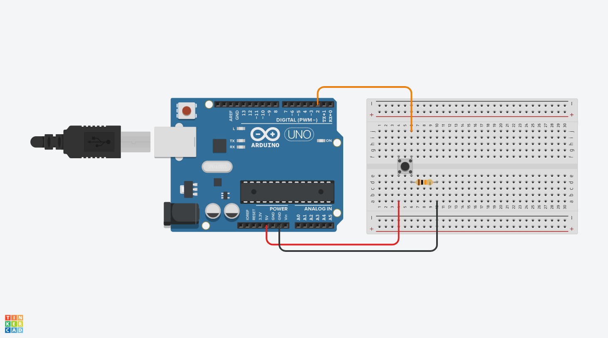
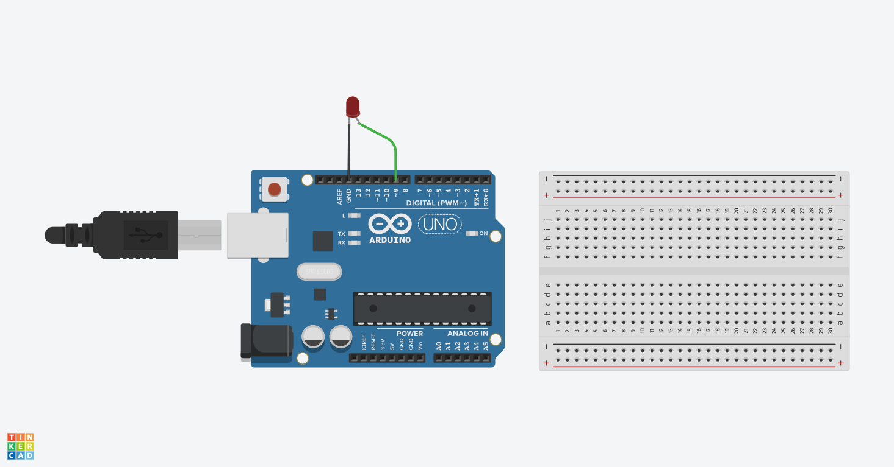
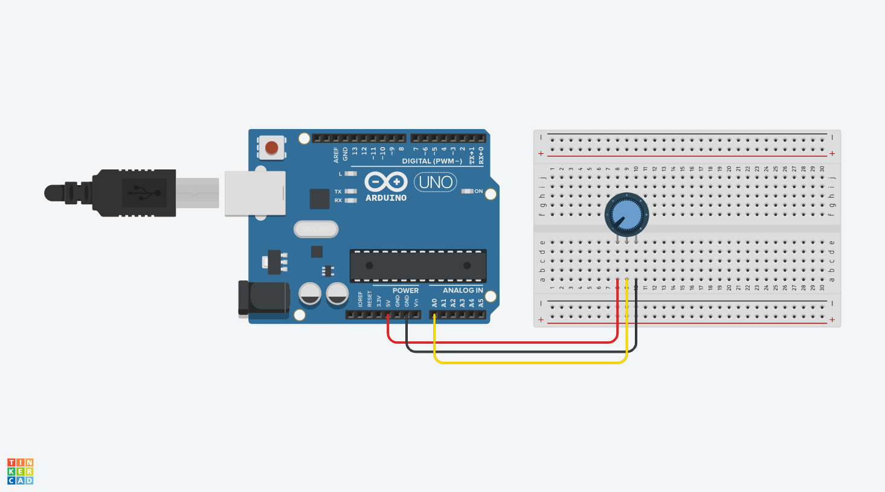
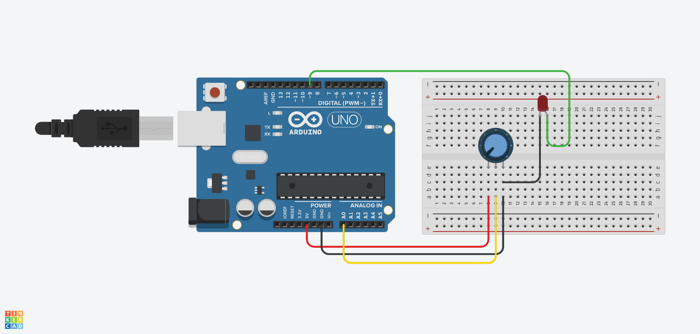
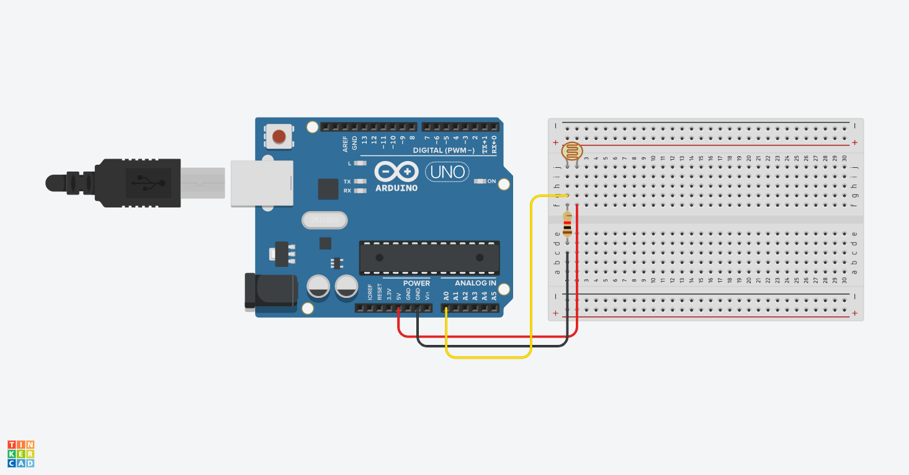
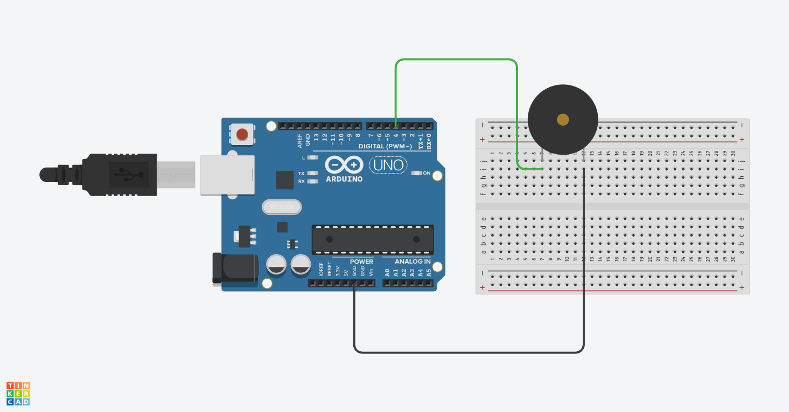
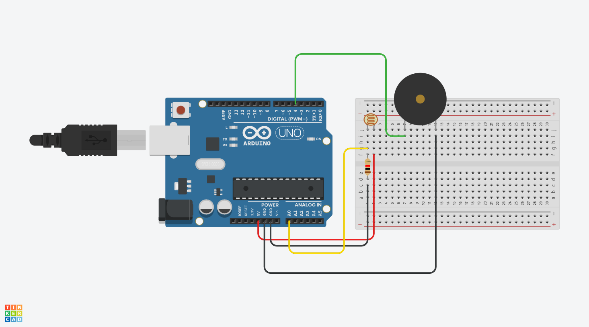

# Basics

| Parts | Quantity |
| :--- | :--- |
| Arduino Uno | 1 |
| Breadboard | 1 |
| LDR \(Photocell\) | 1 |
| LED \(any color\) | 3 |
| Button | 1 |
| Piezo | 1 |
| Potentiometer | 1 |
| Wire Male-to-Male \(any color\) | 5 |
| Resistor 10k | 2 |

### Special characters

Before writing code, make sure you can write the characters! Programming uses several special symbols that may feel alien, so we have a short list below which you can copy & paste from. To figure out how to type these, on Mac, turn on the [Keyboard Viewer](https://support.apple.com/en-euro/guide/mac-help/mchlp1015/mac)!

`/* ( ) { } [ ] | & / > < ; */`

### [Blink](https://www.arduino.cc/en/tutorial/blink)



```cpp
void setup() {
  pinMode(13, OUTPUT);
}

void loop() {
  digitalWrite(13, HIGH);
  delay(1000);
  digitalWrite(13, LOW);
  delay(1000);
}
```

* [ ] Change the LED blink speed using the delay function
* [ ] Create variables for the led pin number and delay amount



```cpp
int ledPin = 13;
int wait = 500;

void setup() {
  pinMode(ledPin, OUTPUT);
}

void loop() {
  digitalWrite(ledPin, HIGH);
  delay(wait);
  digitalWrite(ledPin, LOW);
  delay(wait);
}
```



### [Button](https://www.arduino.cc/en/tutorial/button)








```cpp
void setup() {
  pinMode(2, INPUT);
  Serial.begin(9600);
}

void loop() {
  int buttonState = digitalRead(2);
  Serial.println(buttonState);
}
```


* [ ] Use the Serial Monitor to read the state of the button
* [ ] Create a variable for the button pin
* [ ] Create your own button using your body



### Blink + Button







```cpp
void setup() {
  pinMode(2, INPUT);
  pinMode(13, OUTPUT);
  Serial.begin(9600);
}

void loop() {
  int buttonState = digitalRead(2);
  Serial.println(buttonState);

  if (buttonState == 1){
      digitalWrite(13, HIGH);
  } else {
      digitalWrite(13, LOW);
  }
}
```



### [Fade](https://www.arduino.cc/en/tutorial/fade)







```cpp
int brightness = 0;
int fadeAmount = 5;

void setup() {
  pinMode(9, OUTPUT);
}

void loop() {
  analogWrite(9, brightness);
  brightness = brightness + fadeAmount;
  if (brightness <= 0 || brightness >= 255) {
    fadeAmount = -fadeAmount;
  }
  delay(30);
}
```



```cpp
void setup() {
  pinMode(9, OUTPUT);
}

void loop() {
  float timer = millis()/1000.0;
  int brightness = 128 + 128 * sin(timer);
  analogWrite(9, brightness);
  delay(30);
}
```



### [Potentiometer](https://www.arduino.cc/en/tutorial/potentiometer)







```cpp
void setup() {
  Serial.begin(9600);
}

void loop() {
  int val = analogRead(0);
  Serial.println(val);
}
```

* [ ] Create a variable for the potentiometer pin
* [ ] Use the Serial Monitor to read the value of the potentiometer



### Fade + Potentiometer







```cpp
void setup() {
  Serial.begin(9600);
}

void loop() {
  int val = analogRead(0);
  Serial.println(val);
  analogWrite(9, val/4); // 1024/4 = 256
}
```

* [ ] Add a second potentiometer and LED and get it control the LED brightness



### [Photocell](https://learn.adafruit.com/photocells/arduino-code)







```cpp
void setup() {
  Serial.begin(9600);
}
void loop() {
  int val = analogRead(0);
  Serial.println(val);
}
```

* [ ] Use the Serial Monitor to read the state of the photocell



### Piezo







```cpp
void setup() {
}

void loop() {
  tone(4, 255);
}
```



### Photo resistor + Piezo







```cpp
void setup() {
  Serial.begin(9600);
}

void loop() {
  int val = analogRead(0);
  Serial.println(val);
  tone(4, val);
}
```

* [ ] Connect an LED and have the photocell control its brightness
* [ ] Find piezo melodies and play them!



