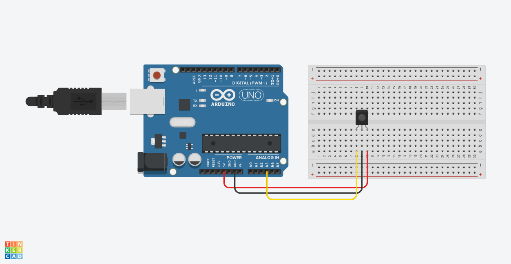

# Proximity

### [Sharp Distance Sensor](https://www.adafruit.com/product/164)











```cpp
void setup() {
  Serial.begin(9600);
}

void loop() {
  int val = analogRead(A3);
  // convert sensor reading into 0-255
  // change 0-600 to whatever fits your sensor
  int mappedVal = map(val,0,600,0,255);
  Serial.print(val);
  Serial.print("\t");
  Serial.println(val);
}
```



### [Maxbotix Ultrasonic Rangefinder](https://www.adafruit.com/product/172)


### [Parallax Wide Angle PIR](https://www.adafruit.com/product/189)


