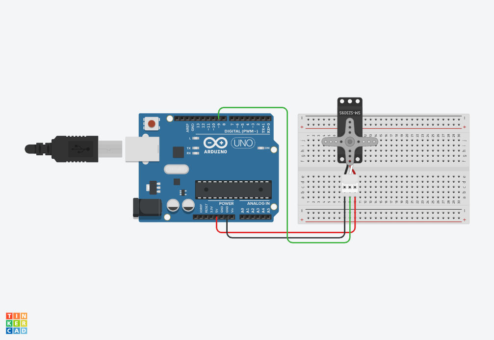
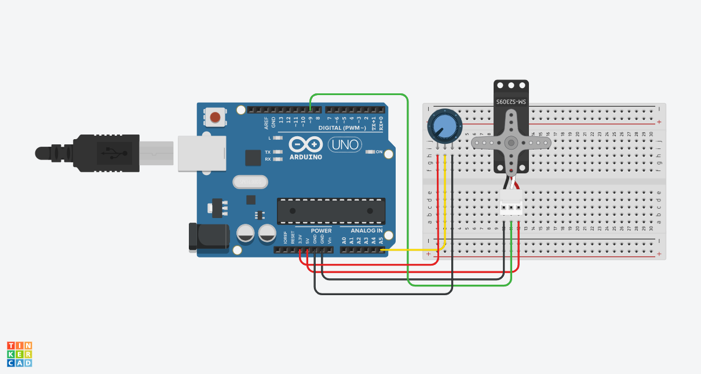

# Motors

### Servo

There are two distinctly different types of servo motors; those that **spin 60-80 degrees in each direction**, and those that can spin **continuously in both directions**. It's difficult to know the type just by looking, so you can try to spin the top with your fingers or attach an adapter and spin that. A full turn mean it's continuous.








```csharp
#include <Servo.h>

Servo myservo;

void setup() {
  myservo.attach(9);
}

void loop() {
  myservo.write(0);
  delay(1000);
  myservo.write(90);
  delay(1000);
  myservo.write(180);
  delay(1000);
}
```




Depending on the servo used, the code will mean different things.  For instance, telling a continuous servo to be at position 0 will make it go reverse, and 180 will spin it forward. A regular servo would instead rotate to the intended position. 



Some servos use the colors Brown/Red/Orange instead of Black/Red/White. 


### Servo + Button







```csharp
#include <Servo.h>

Servo myservo;
int buttonPin = 4;

void setup() {
  myservo.attach(9);
  pinMode(buttonPin, INPUT_PULLUP);
}

void loop() {
  int buttonState = digitalRead(buttonPin);
  
  if (buttonState == HIGH){
    myservo.write(180);
  } else {
    myservo.write(0);
  }
}
```



### Servo + Potentiometer







```csharp
#include <Servo.h>

Servo myservo;

int val;

void setup() {
  myservo.attach(9);
}

void loop() {
  val = analogRead(5);
  val = map(val, 0, 1023, 0, 180);
  myservo.write(val); 
  delay(15);
}
```






