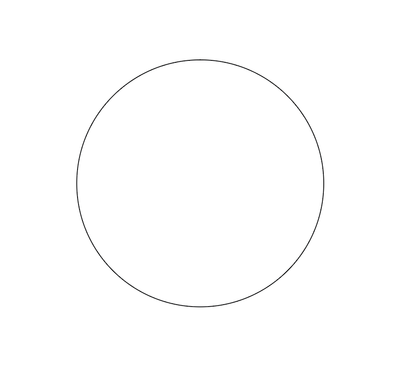
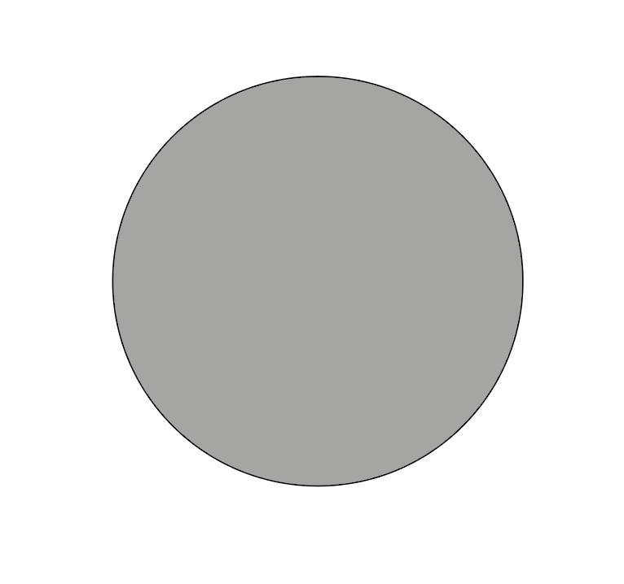
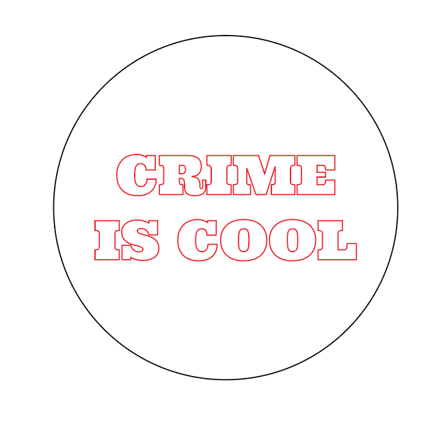

# Getting started

Laser cutting comes down to two properties: Speed \(expressed in mm/s\) and Power \(what % of laser tube power\).  Laser tubes come in lots of different strengths, from 1W to 200W, and these power ratings tend to fade over time, so that is why a % is used instead of a fixed number.

Something very important to remember is that your settings are never permanent- settings you used today might not be exactly the same tomorrow. Testing is very very very important in laser cutting to make sure that you aren't wasting time and material.

There are two ways to make the laser move: cutting and scanning. Cutting is easy, the laser moves along the vector path you have drawn at the speed and power you have set. 

Scanning runs the laser inside the entire area of a closed vector at the speed and power you have set.

You could technically cut out a circle by scanning and burning away all the material inside the circle, but it is much much faster to cut out the circle.


Speed is also written as a minimum and a maximum number. To start, make both of these numbers the same, but if you are looking for cleaner parts, try playing with a lower minimum number. This will reduce the laser power as it turns corners, resulting in less burning.



Using the machine without proper knowledge is prohibited.

1. Do not leave machine unattended when it is working \(stay close and have a look at regular intervals\).
2. Do not cut materials you do not know.
3. Do not stare at a running laser beam. It is bad for your eyes.
4. You should only be cutting materials with no coatings; no paint, lacquer or glue. If you have any doubts about the material you are trying to laser, don’t do it.
5. Do not laser vinyl records, that releases toxic gas that will destroy the laser tube.
6. Check lens and mirrors regularly
7. Check level of coolant and cooler temperature regularly
8. Do not run machine at 100%, think of 80% as the max
9. Clean up after you use the machine If there is something not working properly, make note of it and let others know so it can be fixed.
10. Material not marked is up for grabs, just check that you know what you are cutting.
11. Replenish materials if you are able to do so.


## Prepare your file

### Vector drawing

Laser cutters need a vector drawing to operate. We are using Adobe Illustrator to do this, but any program that can export a .dxf file will work, such as Inkscape, Fusion 360 and TinkerCad.

This drawing is in two colors because we want two different laser operations- black will be a cutting operation \(40mm/s @ 65% power\), and red will be a scanning operation \(200mm/s @ 35% power\). This will create a circle with the words engraved on it. You can use as many different colors as you would like, with each color corresponding to a different laser operation.

### Kerf

Laser cutters have a kerf, meaning that all of your cuts will burn away a certain amount of material, making your cut pieces slightly smaller than designed. Once this number is calculated, you can compensate for it by offsetting your designs. The above example is 150mm wide in Illustrator, but will be something like 149.5mm in real life. For this design, its not super important, but if you are designing parts to fit together, this will affect the fit. [Make a Box ](https://makeabox.io/), a great tool for generating box plans has a field that compensates for kerf, which will translate into how tight the fit of your box pieces is.

### Stroke

All drawings for laser cutting are strokes only, and the smallest possible stroke size. Do not use fills.

### File export

From Illustrator, export a .dxf file, and don't change any of the default settings. When importing this file into the laser software, double check to make sure it is the correct size since dxf files do not have a unit attached to them and your file could get imported at 10x or 1000x bigger sometimes.  

