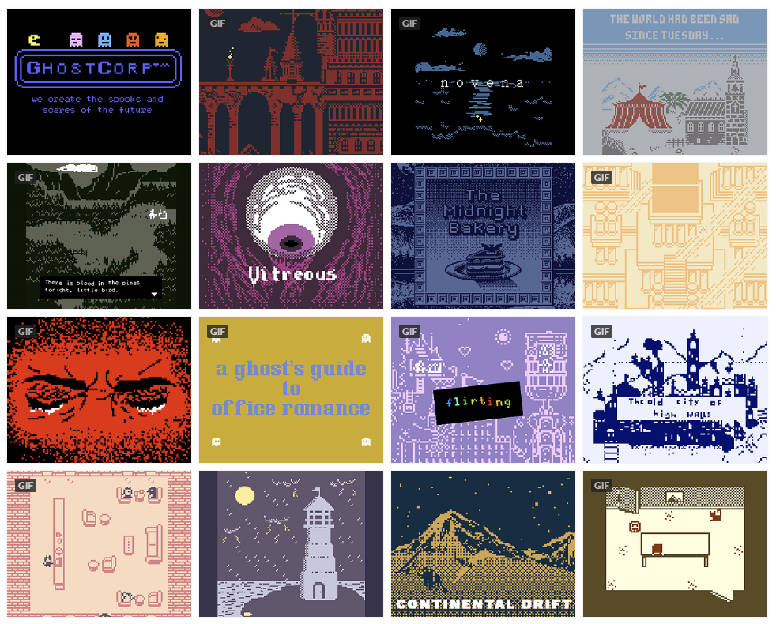

# 🥈 Bitsy challenge

In the early days of computer and video games only monthly magazines provided news and insights. Since there were no screenshots, these magazines often had beautiful artwork re-imagining the experience of playing them. And the texts were in-depth analysis and reconstructions of the current software and hardware. 

Due to those boundaries we were given classics like Tetris, Pong and Return to Monkey Island. Easy to play, difficult to master. 30 years later the lust for "better graphics" have decreased, and there has been for many years a re-surge of story driven experiences, and games that are built solely on minimal mechanics.

In order to practice constructing narratives in a game like world, teams will work with [Bitsy](https://ledoux.itch.io/bitsy); a small game editor for making \([amazing](https://itch.io/c/201121/bitsy-faves)\) worlds to explore.  It requires no programming, and no special software skill. What it does require is imagination, an eye for design and narrative.

To help make matters worse, the way the game is being played should be **out of the ordinary**. Create your own interface using Arduino, entangle it into your experience, make **it** the experience. **The medium is the message**. The only requirement is that **it will not** be played with a conventional keyboard or controller!

You are encouraged to look at the world of events as reference, or stories already found in literature, history, cinema. Avoid getting stuck in coming up with an original story \(get stuck on making an original experience\) as this is an exercise in "keeping it simple" where the choices around you are intentionally limited.

### Deliverable

Each team will create 1 Bitsy game, with at least 1 Arduino interface, to be released on [Itch](https://itch.io/games/tag-bitsy). The game should include music and sound \(we suggest [BeepBox](https://www.beepbox.co/) and [listening to this](https://www.youtube.com/watch?v=OZaR_4us6Ec)\) and be presented to the rest of Hyper by the end of the week! **You have only three days, spend them wisely.**



