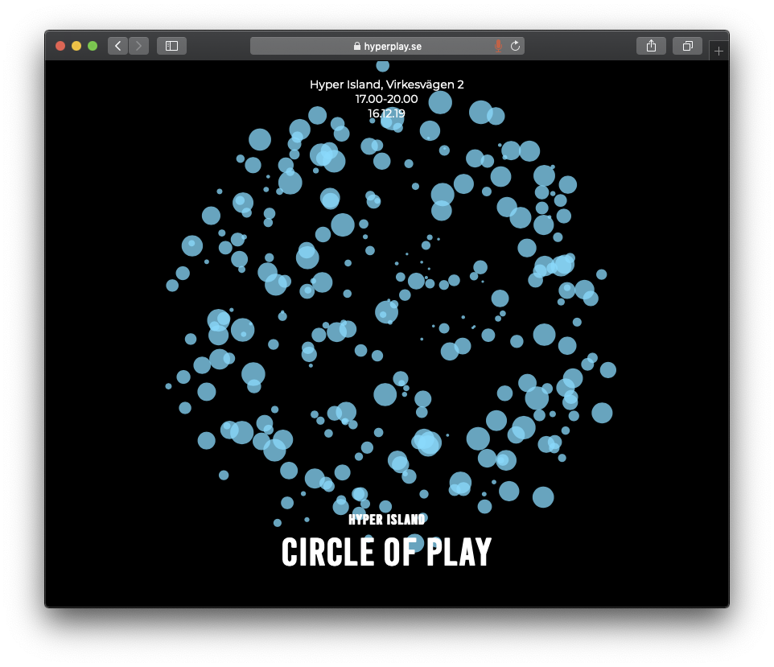

# Exhibition

_Come witness and lose yourself into the magical Hyper Island Circle of Play. A playground of ideas and experiences designed by 17 teams and 100 students of the Digital Media Creative & Design Lead programs by combining meaningful play, narrative and tech._

_Participate. Play. Immerse.   
Become the experience. Leave transformed._

_16/12-19, 17 - 20._



## Website

## [Signage](https://docs.google.com/spreadsheets/d/1-qEFpnXHGDX5kzjbTKUTYsvehagN8hqr8-qB1IG4kIU/edit#gid=0)

Each team will have a laser cut wooden sign including:

1. **Team number**
2. **Project title**
3. **Team members**

## Teams

### Website

_Build a kickass website that provides clear instructions for the event, and shows off the students and their work._

1. [ella.tornquist@hyperisland.se](mailto:ella.tornquist@hyperisland.se)
2. [emma.lussetti@hyperisland.se](mailto:emma.lussetti@hyperisland.se)
3. [rebecca.ravik@hyperisland.se](mailto:rebecca.ravik@hyperisland.se)
4. [scott.ginyard@hyperisland.se](mailto:scott.ginyard@hyperisland.se)

### Marketing

_Communicate the exhibition to  relevant partners, companies, groups, individuals, sponsors, through shareable events, emails and other social channels. Also, create content strategy such as text, image and video, to help drive interest._

1. [michelle.john@hyperisland.se](mailto:michelle.john@hyperisland.se)
2. [gauri.kaushik@hyperisland.se](mailto:gauri.kaushik@hyperisland.se)
3. [emma.kling@hyperisland.se](mailto:emma.kling@hyperisland.se)
4. [vanda.bergstrom@hyperisland.se](mailto:vanda.bergstrom@hyperisland.se)
5. [cornelia.vonbahr@hyperisland.se](mailto:cornelia.vonbahr@hyperisland.se)

### Production & Design

_Establish the visual representation of the Hyper Arcade including signage for the event, event material, digital assets etc._ 

1. [claudia.velhas@hyperisland.se](mailto:claudia.velhas@hyperisland.se)
2. [chandan.ahuja@hyperisland.se](mailto:chandan.ahuja@hyperisland.se)
3. [karl.lindahl@hyperisland.se](mailto:karl.lindahl@hyperisland.se)
4. [frida.eriksson@hyperisland.se](mailto:frida.eriksson@hyperisland.se)
5. [natasha.mehra@hyperisland.se](mailto:natasha.mehra@hyperisland.se)
6. [olivia.kullberg@hyperisland.se](mailto:olivia.kullberg@hyperisland.se)
7. [laura.siuffo@hyperisland.se](mailto:laura.siuffo@hyperisland.se)

### Laser

_Define the booking procedure for using the laser cutter. Also in charge of maintenance and ensuring only allowed materials are used,_

1. \_\_[gustavo.zero@hyperisland.se](mailto:gustavo.zero@hyperisland.se)
2. [cornelia.vonbahr@hyperisland.se](mailto:cornelia.vonbahr@hyperisland.se)
3. [juliusz.mielczarek@hyperisland.se](mailto:juliusz.mielczarek@hyperisland.se)
4. [sara.ekholm@hyperisland.se](mailto:sara.ekholm@hyperisland.se)

