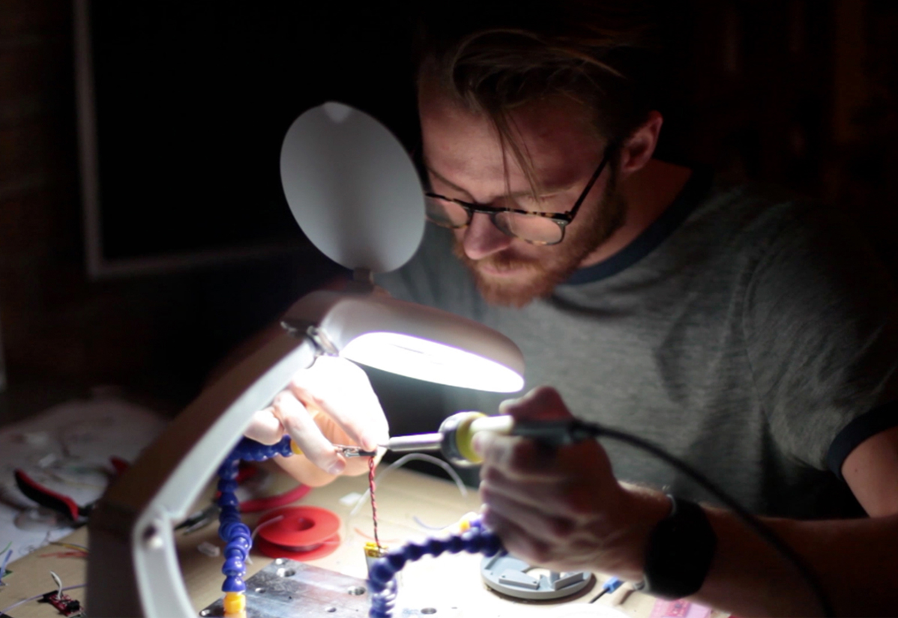

# Team

## Industry Leaders

### [Jonas Johansson](https://jonasjohansson.se/)

Anywhere based artist, designer and programmer transforming light + technology through → play, biology and \(un\)human intervention. Hyper alumni and Industry Leader for Exploring Technology since 2016.  Part of [Nordic Audiovisual Artists](https://nava.community/) and [Svartljus](https://svartljus.se/).

* jns.johansson@gmail.com
* +46721615063

### [Mickey van Olst](https://mickeyvanolst.com/)

Berlin-based artist, designer and programmer.  Dabbles in between kinetic art installations and generative real-time visuals. Studied Art & Technology at Utrecht University of the Arts and IAD at Hyper Island. Strongly connected with various studios such as [onformative](http://onformative.com) and [Waltz Binaire](http://waltzbinaire.com).  For the past years co-lecturing the Exploring Technology course at Hyper Island.

* post@mickeyvanolst.com
* +4915202198352

## Lecturers

### [Maria Euler Kling](http://mariaeuler.com/)

An artists researcher living and loving the interdisciplinary. Alumni of the Royal College of Art in London with a Master in [Information Experience Design](https://www.rca.ac.uk/schools/school-of-communication/ied/), who also studied Physics and Fine Art. Builds tangible, transformative and joyful experiences based on complex scientific concepts, ideas and experiments from electromagnetic sculptures to virtual galleries of quantum teleported art pieces. Searching and finding meaningful experiences and inspiration in science fiction, games and in collaborations with researchers of various disciplines.

### [Duncan Gidney](https://duncangidney.com/)

A creative artist and designer interested in play, music and surprising people. A Hyper alumni from Canada, currently based in Amsterdam! Duncan have done projects based on the Internet of things, furniture design, and a skateboard that shoots flames.

### [Half Scheidl](https://hscheidl.com/)

Digital artist who combines code and technology to create illustrations, animations and interactive installations. Grew up in Brazil, lived in Finland for 8 years and a Swede since 2017. He is the organiser of the Creative Coding Stockholm Meetup group, and a big fan of Processing.

### [Gunnlaugur Egilsson](https://www.instagram.com/gunnlaugr/)

Explorer of alternative worlds, wether that is within the confines of augmented or virtual reality, digital design, escape games, devised theatre or choreography. Retired ballet & modern dancer born in Iceland that left the theatre scene for the digital one. Freelance front-end developer and digital designer and a Hyper alumni currently studying Virtual Reality development. Been playing roleplaying games since 1987 and computer games since Sinclair spectrum.

### [Andreas Refsgaard](https://andreasrefsgaard.dk/)

Artist and creative coder based in Copenhagen. Uses algorithms and machine learning to allows people to play music using only eye movement and facial gestures, control games by making silly sounds or transform drawings of musical instruments on paper into real compositions. Copenhagen Institute of Interaction Design alumni. Contributor to [Machine Learning for Artists](https://ml4a.github.io/).

### [Linnéa Östedt Harrison](https://www.linkedin.com/in/linnea-harrison-4323552b/)

Linnea began playing games during the ’90s, and through a passion for creating experiences, she discovered that she also had a passion for making games. After shipping games in the Call of Duty, Battlefield, Star Wars and Mirror’s Edge franchises, Linnea now works as Creative Director at the VR studio Neat Corporation.

## Assistant lecturers

### [Anne Obel](https://www.instagram.com/annie.script4/)

Fun gal that loves to get her hands dirty, and building stuff that hasn’t been made before. Is passionate about problem solving, and finding solutions that are inclusive. Beckmans and Krabbesholm alumni. Half Danish and Norwegian, and now speaks every Scandinavian language… Worked with product and furniture design, interior architecture, web development, video and radio production.

→ Listen to the first episode of Anne's podcast [Birth of Living Code](https://podcasts.apple.com/no/podcast/birth-of-living-code/id1485542035#episodeGuid=37014fc0-3d19-6e4e-c7b2-1d1e809236e2)!

### [Ana Shcherbakova](https://linkedin.com/in/ana-shcherbakova)

An elfish \(kinda\) human being. Ana has come a long way from linguistics to web development. With several spoken languages in her mind, she turned to programming to continue her training, and is now trying to use her passion for design and code to become the best designer & developer possible!

## Collaborators

### Johanna Nordin

A happy camper within tech and data. Has attended the Amsterdam [Fab Academy](https://fabacademy.org/) and is responsible for The Space; the in-house maker laboratory at Hyper Island Stockholm. She is on the board of [Kids Hack Day](https://www.kidshackday.com/), has previously run the [Hyper Island kids summer camp](https://vimeo.com/239974492) and is currently focused on Hyper Island's online educations for professionals and companies!

### [Folk Lab](https://www.folklab.nu/)

A kombucha of the digital fabrication movement, Folkets hus and the mission to create meaning, socially and digitally, Folk Lab hosts pop-up labs, workshops and education, and collectively build active meeting places and digital lab.  All in order to invite increased participation in the global goals for sustainability. The Folk Lab meaning machine hosts several technologies made to enable small and large fabrication and ideation, and are renting one of their [laser cutters](../learn/hardware/laser-cutting/machines.md) to Hyper Island for the Exploring Technology project.

### [SGEM](http://sgem.se/)

The Stockholm Genetically Engineered Machines and is a non-profit association, founded in 2015 to ensure annual participation in the iGEM competition by a team from Stockholm.  [Rasmus Bengtsson](https://rasmusbengtsson.com/), Hyper alumni, former iGEM and current SGEM member  will present the possibilities within synthetic biology and inspire serious interdisciplinary collaborations!

## Class representatives

| Week | Who |
| :--- | :--- |
| 47-51 | [nanda.vandenhoek@hyperisland.se](mailto:nanda.vandenhoek@hyperisland.se) [nadine.ochsner@hyperisland.se](mailto:nadine.ochsner@hyperisland.se) |
| 47 | [alice.abrahamsson@hyperisland.se](mailto:alice.abrahamsson@hyperisland.se) [michelle.john@hyperisland.se](mailto:michelle.john@hyperisland.se) |
| 48 | [gauri.kaushik@hyperisland.se](mailto:gauri.kaushik@hyperisland.se) [ezequiel.almonacid@hyperisland.se](mailto:ezequiel.almonacid@hyperisland.se) |
| 49 | [paras.agarwal@hyperisland.se](mailto:paras.agarwal@hyperisland.se) [anna.shadricheva@hyperisland.se](mailto:anna.shadricheva@hyperisland.se) |
| 50 | [ben.angel@hyperisland.se](mailto:ben.angel@hyperisland.se) [juliusz.mielczarek@hyperisland.se](mailto:juliusz.mielczarek@hyperisland.se) |
| 51 | [claudia.velhas@hyperisland.se](mailto:claudia.velhas@hyperisland.se) [linnea.bergling@hyperisland.se](mailto:linnea.bergling@hyperisland.se) |

