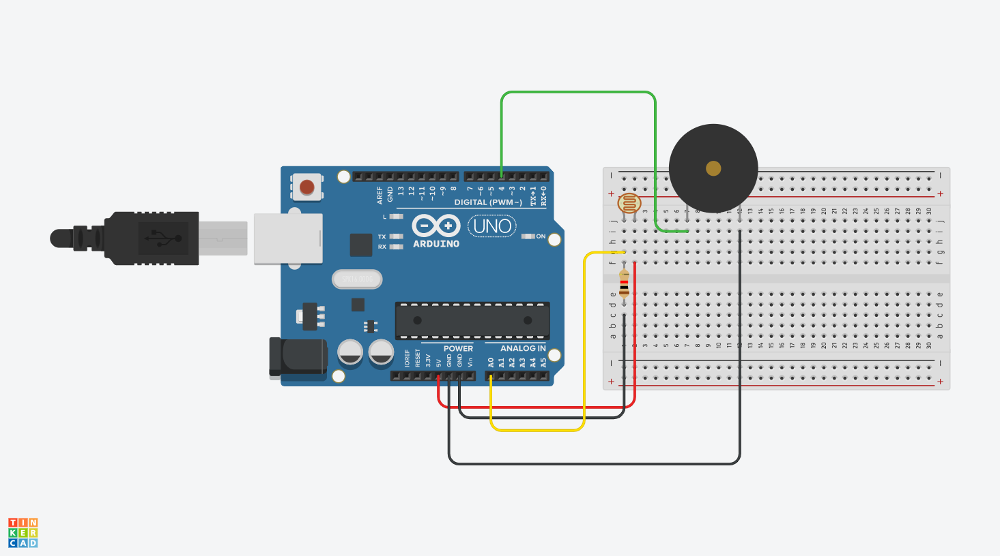

# Basics

| Parts | Quantity |
| :--- | :--- |
| Arduino Uno | 1 |
| [Breadboard]() | 1 |
| LDR \(Photo resistor\) | 1 |
| LED \(any color\) | 3 |
| Button | 1 |
| Piezo | 1 |
| Potentiometer | 1 |
| Wire Male-to-Male \(any color\) | 5 |
| Resistor 10k ohm   | 1 |
| Resistor 220 ohm | 1 |

Before writing code, make sure you can write the characters! Programming uses several special symbols that may feel alien, so we have a short list below which you can copy & paste from. To figure out how to type these, on Mac, turn on the [Keyboard Viewer](https://support.apple.com/en-euro/guide/mac-help/mchlp1015/mac)!

`/* ( ) { } [ ] | & / > < ; */`

### Debug

**Serial monitor** and **Serial plotter** help troubleshoot moments when expectations don't meet reality, i.e "the code doesn't work!".

We can tell our Arduino to send information about what is happening using "serial communication" and by typing `Serial.begin(9600)` in  `setup()` with 9600 being the default baud rate, the speed which the computer and the Arduino communicates.

To print information type `Serial.println()` and within the parentheses you can print out variables, strings, numbers and more.

## Example 1

### Blink

```cpp
void setup() {
  pinMode(13, OUTPUT);
}

void loop() {
  digitalWrite(13, HIGH);
  delay(1000);
  digitalWrite(13, LOW);
  delay(1000);
}
```

### Button







```cpp
int buttonPin = 2;

void setup() {
  pinMode(buttonPin, INPUT_PULLUP);
  Serial.begin(9600); // start communication with your Arduino via the USB cable
}

void loop() {
  int buttonState = digitalRead(buttonPin);
  Serial.println(buttonState); // send value to your computer
}
```



### Blink + Button







```cpp
int buttonPin = 2;
int ledPin = 13;

void setup() {
  pinMode(buttonPin, INPUT_PULLUP);
  pinMode(ledPin, OUTPUT);
  Serial.begin(9600);
}

void loop() {
  int buttonState = digitalRead(buttonPin);
  Serial.println(buttonState);

  if (buttonState == 1){
      digitalWrite(ledPin, HIGH);
  } else {
      digitalWrite(ledPin, LOW);
  }
}
```



## Example 2

### [Fade](https://www.arduino.cc/en/tutorial/fade)







```cpp
int brightness = 0;
int fadeAmount = 5;

void setup() {
  pinMode(9, OUTPUT);
}

void loop() {
  // float timer = millis()/1000.0;
  // brightness = 128 + 128 * sin(timer);
  analogWrite(9, brightness);
  brightness += fadeAmount
  if (brightness <= 0 || brightness >= 255) {
    fadeAmount = -fadeAmount;
  }
  delay(10);
}
```



### Potentiometer







```cpp
void setup() {
  Serial.begin(9600);
}

void loop() {
  int val = analogRead(0);
  Serial.println(val);
}
```

* [ ] Create a variable for the potentiometer pin
* [ ] Use the Serial Monitor to read the value of the potentiometer



### Fade + Potentiometer







```cpp
int ledPin = 9;

void setup() {
  pinMode(9, OUTPUT);
  Serial.begin(9600);
}

void loop() {
  int val = analogRead(0);
  Serial.println(val);
  int remappedVal = map(val, 0, 1023, 0, 255);
  analogWrite(ledPin, remappedVal);
}
```

* [ ] Add a second potentiometer and LED and get it control the LED brightness



## Example 3

### Photocell







```cpp
void setup() {
  Serial.begin(9600);
}
void loop() {
  int val = analogRead(0);
  Serial.println(val);
}
```

* [ ] Use the Serial Monitor to read the state of the photocell



### Piezo







```cpp
int piezoPin = 4;

void setup() {
}

void loop() {
  tone(piezoPin, 255);
}
```



### Photo resistor + Piezo







```cpp
int piezoPin = 4;

void setup() {
  pinMode(piezoPin, OUTPUT);
  Serial.begin(9600);
}

void loop() {
  int val = analogRead(0);
  Serial.println(val);
  
  // check your serial monitor for the range (ie. 300-800)
  int remappedVal = map(val, 300, 800, 0, 255);
  tone(piezoPin, remappedVal);
}
```

* [ ] Connect an LED and have the photocell control its brightness
* [ ] Find piezo melodies and play them!



