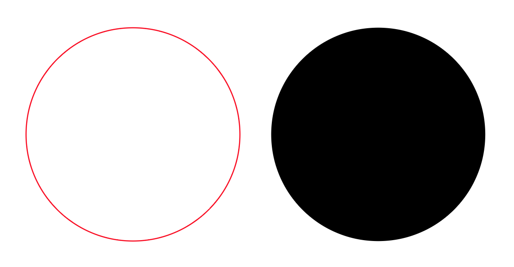
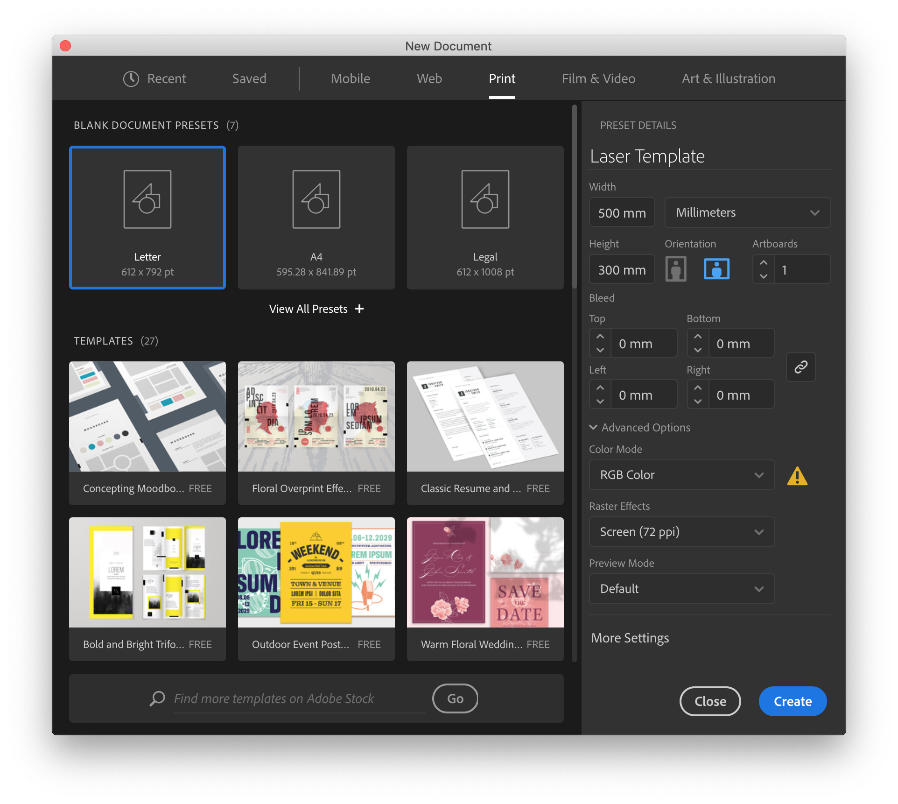
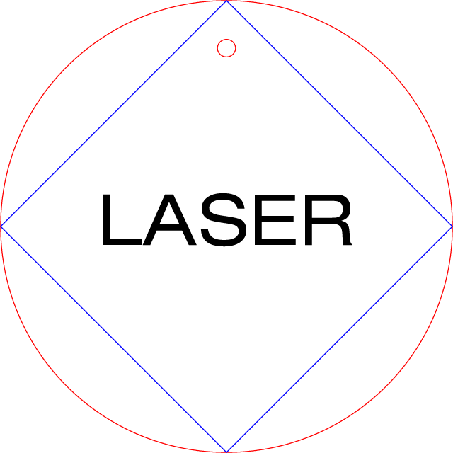

# Basics

Laser cutting comes down to **Speed** \(mm/s\) and **Power** \(% of laser tube power\). Laser tubes come in different strengths, from 1W to 200W, and these power ratings tend to fade over time, which is why percentage is used instead of a fixed number.

There are also two ways to make the laser move, **Cutting** and **Scanning** \(engraving\).

Cutting \(left\) is easy, the laser moves along the vector path you have drawn at the set speed and power. Scanning \(right\) runs the laser inside the entire area of a closed vector.

Shapes for cutting should have **no fill** and **0.1 mm stroke**. The width of the stroke should ideally match the width of the laser, measure if needed. The stroke color is later referenced in the laser software, and the conventions are **red** for cutting through, **blue** for "marking".  You can use as many different colors as you would like, with each color corresponding to a different laser operation.

Shapes and images for scanning should have a **black fill** and **no outline**.

_Let's try it out!_

## Setup

With a vector design tool, create a new document with the same dimensions as the intended laser printer. Use millimeters \(mm\). The Color Mode should be RGB. This example is using Adobe Illustrator, but Inkscape, Fusion 360 and TinkerCad will also work.

Confirm that the document units and color mode. In Illustrator this can be done under Window &gt; Properties and File &gt; Document Color Mode.

## Design

Let's create something that includes both cutting and engraving. A round pendant with an inner shape, text and a hole for a thread.

1. Draw an outer shape with **no fill** and a **red stroke**. This shape will be cut. 
2. Draw a smaller shape with the same settings for the hole.
3. Draw an inner shape with a **blue stroke**. This shape will be marked.
4. Add a text layer with a **black fill**.
5. Draw a smaller 
6. Resize the shape to fit the desired measurements.





### Kerf

Laser cutters have a kerf, meaning that all cuts will burn away a certain amount of material, making your cut pieces slightly smaller than designed. Once this number is calculated, you can compensate for it by offsetting your designs. The above example is 50mm wide, but will be something like 49.5mm in real life. For this design, its not super important, but if you are designing parts to fit together, this will affect the fit.

## Export

Several formats can be used to save the file, and a very common one is DXF \(Drawing eXchange Format\) which is often used for architectural drawings. If exporting to Inkscape, AI and SVG formats will work fine.

When importing this file into the laser software, double check to make sure it is the correct size since DXF files do not have a unit attached to them and the file could get imported at 10x or 1000x.

In case the design happens on the same machine as the laser software it should be possible to "print" directly to the laser. In that case, simply print and choose the laser printer. It should then show up in the laser software or on the printer display.

## Settings

Below are guideline values based on [Material Test Card for Laser Cutting and Engraving](https://www.thingiverse.com/thing:2243854).









