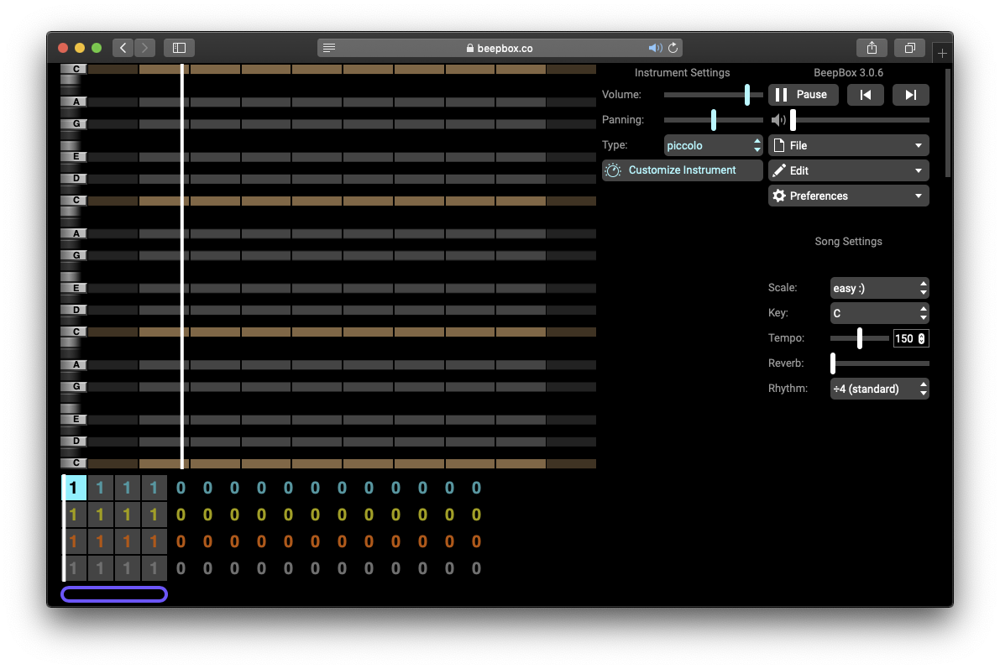

# Beepbox

Considering sound can elevate a project, help the listener along, provide cues and more. Sounds can be understood in many shapes, music, melody, sound effect or even complete silence. There are several great applications out there for getting started, such as [Ableton Live](http://ableton.com/) and [Reaper](https://www.reaper.fm/). To venture into more unknown territories, have a look at [TidalCycles](https://tidalcycles.org/index.php/Welcome), where music happens through code.  [Beepbox](https://www.beepbox.co/) is a dead simple tool with several opportunities, and an inspiring helping hand into the world of audio production. 

### Install

Beepbox \([link](https://www.beepbox.co/#8n31s0k0l00e03t2mm0a7g0fj07i0r1o3210T5v1L4ua3q1d4f7y5z1C0c4h0HTP9Bx99sp99900T0v1L4u86q1d4f9y0z9C0w6c0h3T1v1L4u30q1d5f9y1z7C1c0A9F4B0V1Q19e4Pb631E0067T4v1L4uf0q1z6666ji8k8k3jSBKSJJAArriiiiii07JCABrzrrrrrrr00YrkqHrsrrrrjr005zrAqzrjzrrqr1jRjrqGGrrzsrsA099ijrABJJJIAzrrtirqrqjqixzsrAjrqjiqaqqysttAJqjikikrizrHtBJJAzArzrIsRCITKSS099ijrAJS____Qg99habbCAYrDzh00b4h400000000h4g000000014h000000004h400000000p16000000)\) runs in the browser and requires no installation.

### Setup

To get a better view of the interface, open **Preferences** and select **Full-Screen Layout**. You should see something like this.

In the bottom there are **4 rows** and **16 columns**, with **4 of the columns highlighted**. 

The purple selection defines the amount of columns to be included.

Each row has a color, corresponding to an instrument. **Teal/Yellow/Red** can be set to any type of instrument, while **Grey** is used for percussion. Besides the color there is number containing a unique pattern. Each instrument can have ten different patterns 0-9.

Each number corresponds to a **pattern,** which  can be edited in the piano roll section.  Each instrument can have ten different patterns.

In _song settings -_ that you see in the following image -  __you can change the **tempo** \(BPM\) of the sequencer. Press **space bar** to **play/stop**. The scale "normal :\)" corresponds to a major scale, while "normal :\(" to a minor scale. If you select a scale, you will be allowed to use only notes that belogs to that scale \(harmony safe option\). Selecting expert you can use all notes \(weird stuff option\).

### Play

Now that the setup is  done, you can start to create by "drawing" notes on the pianoroll: you do it by clicking in a selected cell.  When you add notes you can change the duration of each note by clicking and dragging. In this way you can use different time divisions, creating different rhythmic patterns.

After writing a note it is possible to modify it, by clicking and dragging up or down: in this way you will obtain the so called **glide effect**. ****That means there will be no interruption between one note and the next one, and the pitch will slide between different values, instead of jumping. You can find this function in several synths, and can also be called **portamento**. In the following image you'll see how a note with glide effect looks like in Beepbox.

**Every row** \(Teal/Yellow/Red\) **has a different octave**: red is the lowest one, teal the highest one. That means that is preferable to use patterns in the **red row to create bass lines** and harmonies, while using teal/yellow row for melodies and arpeggios. As we said before, the bottom row \(grey\) can only contain percussive sounds.

### Save

After composig your tune, copy the link to safe your work! In this way, opening the link again, you'll be able to edit your song. 

When you are finished, you can export a .wav fine through the file menu: file &gt; export song. At this point you will see something like that:

Select "export to .wav file" to obtain an audio file, and choose the number of times you want your loop to be played by the sequencer. You will then find your file in the _download_ folder.

Let's understand some music theory to be guided during the writing process!

