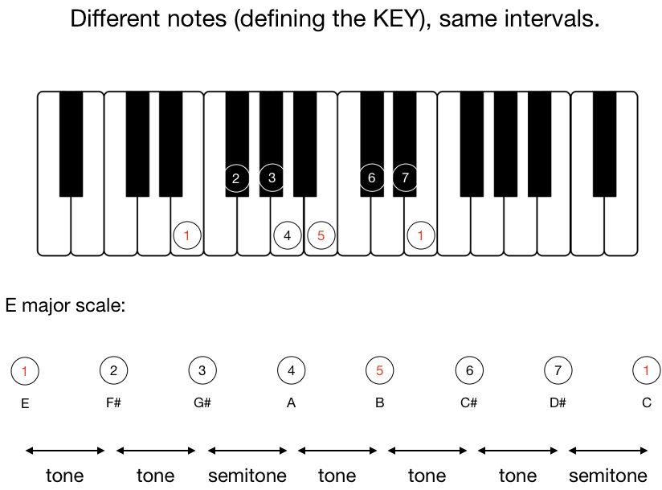

# Music introduction

Common denominator to define music is **sound** and every kind of **vibration** that can reach our ear.  
Edgard Varèse \(1883 -1965\) described music as "organised sound", while Luciano Berio \(1925 - 2003\) as "everything that one listens to with the intention of listening to music".

Three main parameters can be considered to describe sound: **duration** \(time\), **pitch** \(frequency\), **amplitude** \(intensity\).  These parameters can be represented in different ways, for instance can be written on **sheet music** or analysed with a **spectrogram**. A spectrogram, showing the spectral content of a sound, gives accurate information about the timbre.

## Notes and their relationships.

Setting different relationships between notes will bring to really different results.  
In the following examples you can ear the same melody, juxtapose to different _pedal_ notes







