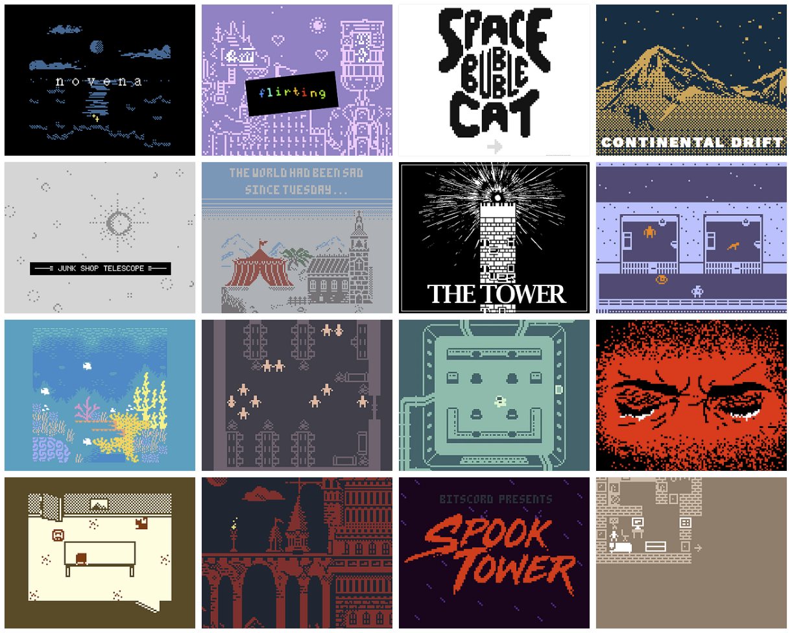

# Bitsy

> Bitsy is a little editor for little games or worlds. the goal is to make it easy to make games where you can walk around and talk to people and be somewhere. — Adam Le Doux, creator of Bitsy

Games made in Bitsy range wildly in their size, scope, and genre, but it works especially well for short narrative games, little vignettes, or games about being in one place and wandering around. 

Bitsy is defined by its constraints. It has limited interaction, only three colors, and very little programming. The pixel canvas is tiny. However, this simplicity is incredibly useful for making focused and deliberate ideas. It gives every choice a lot of weight. Because it is so simple, it is also a great tool for prototyping ideas, or getting something down on paper right away. 

Besides Bitsy there are several other minimal game design tools and languages around that can be of interest.

| Name | Difficulty |
| :--- | :--- |
| [Twine](https://twinery.org/) | 🍰 |
| [Pico-8](https://www.lexaloffle.com/pico-8.php) | 🧚 |
| [Phaser](https://phaser.io/) | 🧚 |
| [Gdevelop](https://gdevelop-app.com/) | 🧚 |
| [GameMaker](https://www.yoyogames.com/) | 🧚 |
| [Babylon](https://www.babylonjs.com/games/) | 🧚 |
| [Haxe](https://haxe.org/) | 💀 |
| [Unreal](https://www.unrealengine.com/) | 🧚 |
| [Unity](https://unity.com/) | 🧚 |
| [RPG Maker](https://en.wikipedia.org/wiki/RPG_Maker) | 🍰 |

### Inspiration

Like Twine, Bitsy is nurturing creatives around the world, and spreading the joy of games, and game-driven stories. Follow [Bitsy Pieces](https://twitter.com/bitsypcs) to see what is happening within the community around the world, and join [Bitsy Talk](https://discordapp.com/invite/9rAjhtr), the Bitsy discord channel. 

To find inspiration from other tools install [Steam](https://store.steampowered.com/), and frequent sites like [Game Curator](https://game-curator.com/) and [Game Jolt](https://gamejolt.com/). And the best inspiration is a good challenge, [participate in "jams"](https://itch.io/jam/) such as [Ludum Dare](https://ldjam.com/)!

Peaked your interest in creating games? Get fired up by reading the [Scratchware Manifesto](http://homeoftheunderdogs.net/scratch.php) and [some great rants](https://voec.itch.io/zineszineszines).

#### Games to play

| Title | Author |
| :--- | :--- |
| [Forward](https://citron-curieux.itch.io/forward) | [Citron Curieux](https://citron-curieux.itch.io/) |
| [To the moon](https://freebirdgames.com/to_the_moon/) | [Freebird Games](https://freebirdgames.com/) |
| [ORUL](https://egordorichev.itch.io/orul) | [Egor Dorichev](https://egordorichev.itch.io/) |
| [Unseen Light](https://ducklingsmith.itch.io/the-unseen-light) | [David Mowatt](https://ducklingsmith.itch.io/) |

