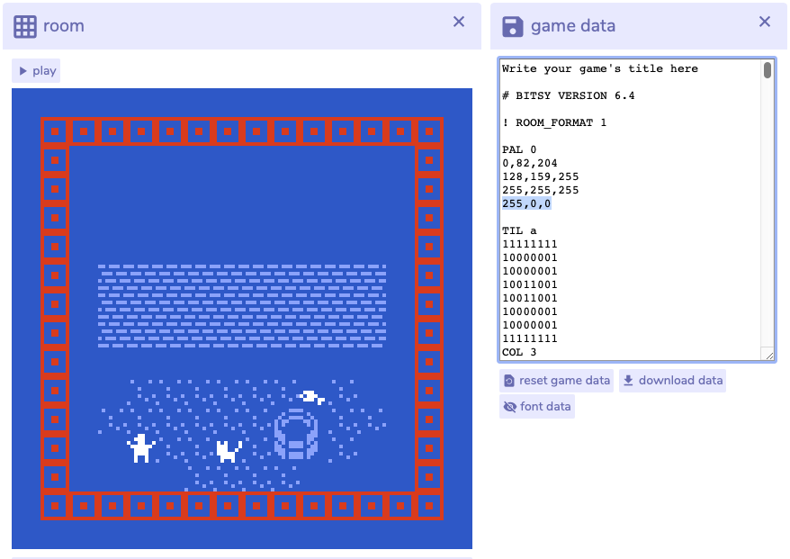

# Advanced

At some point, _regular_ Bitsy will not be enough, meaning, it's time to hack! Now, most hacks require some level of coding, whilst others are more like tools:

* Adding audio: [https://candle.itch.io/bitsy-audio](https://candle.itch.io/bitsy-audio)
* Turn an image into pixels: [https://ruin.itch.io/image-to-bitsy](https://ruin.itch.io/image-to-bitsy)
* Generate custom fonts: [https://seansleblanc.itch.io/fontsy](https://seansleblanc.itch.io/fontsy)

## Existing hacks

Thanks to a vibrant community there are [several hacks](https://github.com/seleb/bitsy-hacks) built on Kitsy, a small framework extending Bitsy. These hacks are [inserted into the Bitsy HTML file](https://github.com/seleb/bitsy-hacks#how-to-use), and if that process feels too complex, [Borksy](https://ayolland.itch.io/borksy) allows hacks to be easily toggled!


Some hacks are more or less difficult to implement, and in overall getting a hack to work as intended requires dedication and learning!


These are the steps to follow:

1. Find the code to the hack of interest \([example](https://github.com/seleb/bitsy-hacks/blob/master/dist/dialog-audio.js)\)
2. Copy & paste the code into the HTML file \(see below\)
3. Follow the instructions in the code
4. Reload the game

```markup
  <script>
    // and then paste your code here!
  </script>
</head>
<body onload="startExportedGame()">
  <canvas id="game"></canvas>
</body>
```

## Custom hacks

If the hacks available just don't feel right, [write custom ones](https://github.com/seleb/bitsy-hacks/wiki)! And if that feels like a bit too large of a mountain to climb, it's also possibly to include a script that listens to Bitsy events, such as `onPlayerMoved()` which happens every time the player avatar moves.

```markup
    <script src="https://gistcdn.githack.com/jonasjohansson/938e71f56ad76c01d9c6f2d7c2fed3c5/raw/e7270bc2bb73315abd7faa6fe50790c7c27ec57d/kitsy-events.js"></script>
    <script>
      foo.after("onPlayerMoved", function() {
        console.log("onPlayerMoved");
      });
    </script>
  </head>
  <body onload="startExportedGame()">
    <canvas id="game"></canvas>
  </body>
</html>
```

## **Adding Colors**

It is technically possible to go beyond Bitsy's limited palette by opening **game data** and editing the text. Any change to the editor gets immediately writing to the game data, and vice versa. Adding a color to a palette is easy:

1. Find the palette by looking for "PAL 0" where 0 is the number of the palette.
2. After the three rows of RGB values, add a fourth one with the desired values.
3. Find the object that should use the fourth color. The objects available are Tile \(TIL\), Sprite \(SPR\) and Item \(ITM\).
4. After the matrix of 0 and 1, add "COL 3". It's 3 because the Bitsy starts counting at 0!
5. Click anywhere outside of the game data window to trigger the change.




