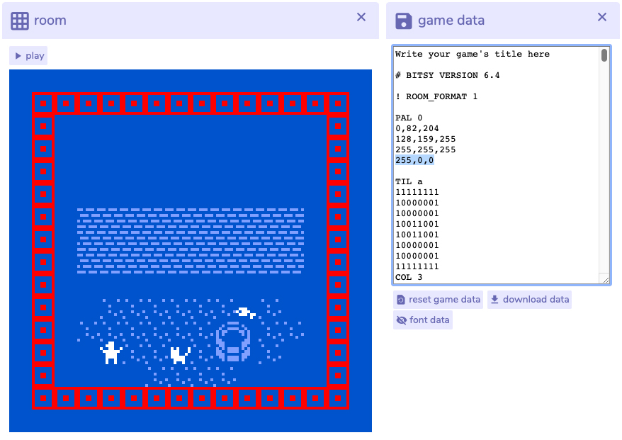

# Colors

It is technically possible to go beyond Bitsy's limited palette by opening **game data** and editing the text. Any change to the editor gets immediately writing to the game data, and vice versa.

Adding a color to a palette is easy:

1. Find the palette by looking for **PAL 0** where 0 is the number of the palette.
2. After the first three rows of RGB values, add a fourth one with the desired values, for instance `255,0,0` \(red\).
3. Find the object that should use the fourth color. The objects available are Tile \(TIL\), Sprite \(SPR\) and Item \(ITM\).
4. After the matrix of 0 and 1, add **COL 3**. Bitsy starts counting at 0, so the fourth color has the index of 3, a fifth color would be 4 and so on…
5. Click anywhere outside of the game data window to trigger the change.

