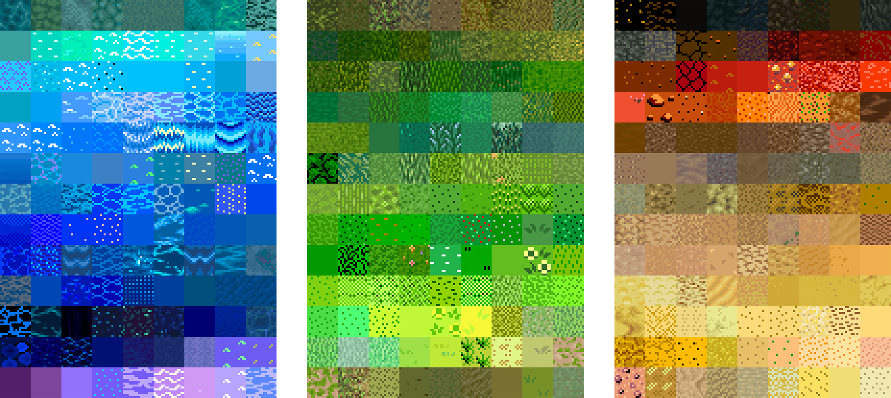

# The Spriters Resource

It is fortunate designing pixel games, as so much has already been made, so there's lots of great inspiration out there. [The Spriters Resource](https://www.spriters-resource.com/) rips the sprite sheets from games, so that others may understand better the graphic design within classic games like Final Fantasy or Super Mario.

