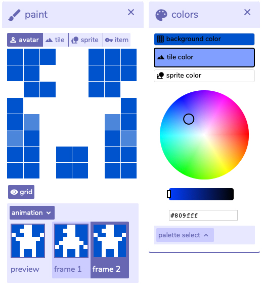

# Paint & Colors

The paint window is where avatars, sprites, tiles and items are drawn. Click any pixel in the avatar, and it will either appear or disappear.  
****

If you expand the **animation** option at the bottom of the window, you can add a second frame. The other tabs in the paint window behave equally. Notice that the pixels from the previous frame have their opacity reduced.

### Colors

Picking the right colors help set the mood and ambiance. You get three colors: **Background**, **tile** and **sprite**. Pay extra attention to **Palette select** as it is possible to create multiple palettes, which can later be used for different rooms.

 Use [Happy Hues](https://www.happyhues.co/), [Leonardo](https://leonardocolor.io/) or [Palettsy](https://zenzoa.itch.io/palettsy) for inspiration!


The default colors are: **\#0052cc** \(background\), **\#809fff** \(tile\) and  **\#ffffff** \(sprite\).


