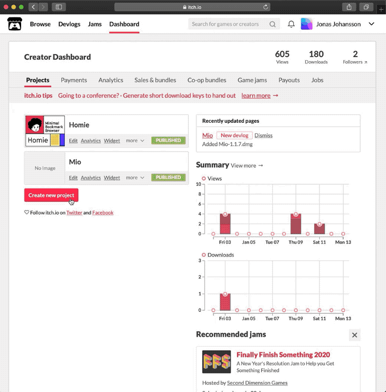

# Upload

There are many ways of sharing the Bitsy game with others, and one of the best would be to use Itch where several of the existing games already live.

Create an account on [Itch](https://itch.io/), choose [Upload new Project](https://itch.io/game/new) and follow the instructions below. It is also possible to upload a ZIP file with music included.

