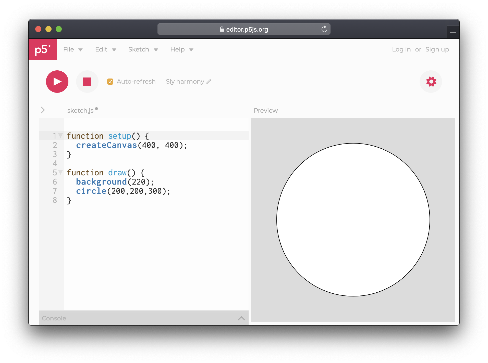
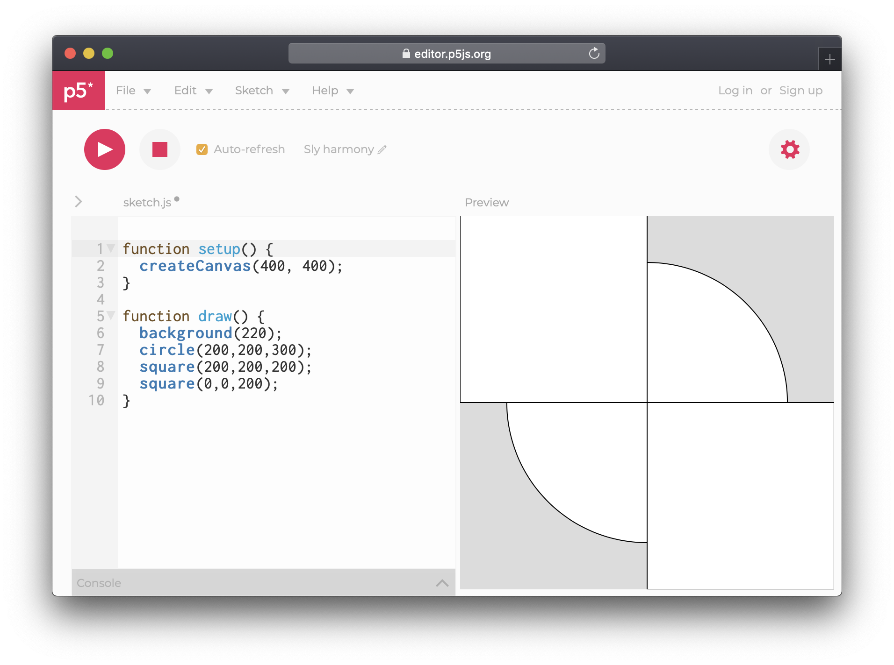

# Shapes

It is possibly to draw all kinds of vector shapes. Let us begin drawing by adding a circle. The circle function takes three parameters: x, y and diameter, and should be added inside the draw function.

```javascript
circle(200,200,300);
```

The first two \(200, 200\) values tell the circle how to be positioned in x and y, while the last decides the diameter. In our case, since the canvas is 400 pixels in both width and height, the circle will be placed in the middle of our canvas, since the circle point of origin is its centre.




It is highly recommended to read up on each function using the [Processing References](https://p5js.org/reference/), as they are not all the same.


Besides circles we can also add squares. After the circle, make a new line by pressing Enter, then type…

```javascript
square(200, 200, 200);
square(0, 0, 200);
```

The first two values here are just like the circle, defining x and y, or, the distance from the left and top. However, squares do not have their point of origin in the centre, instead they "start" at their top left point.



