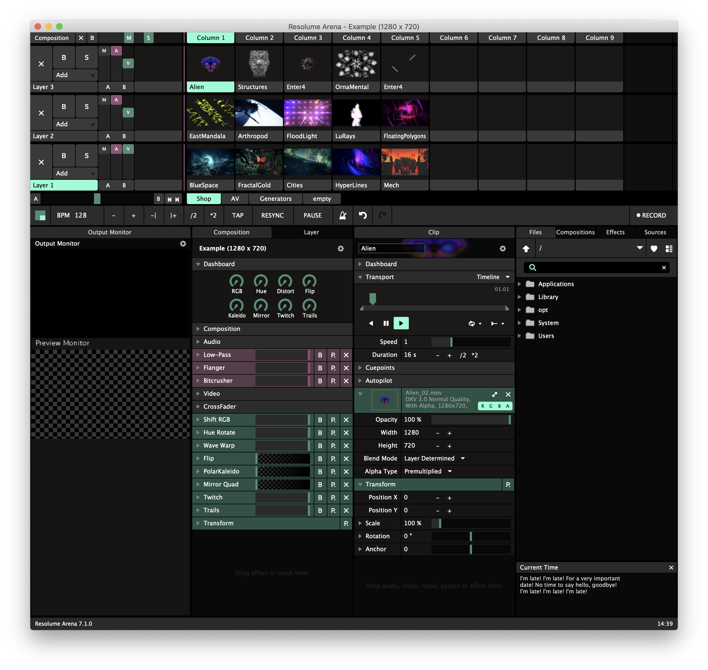
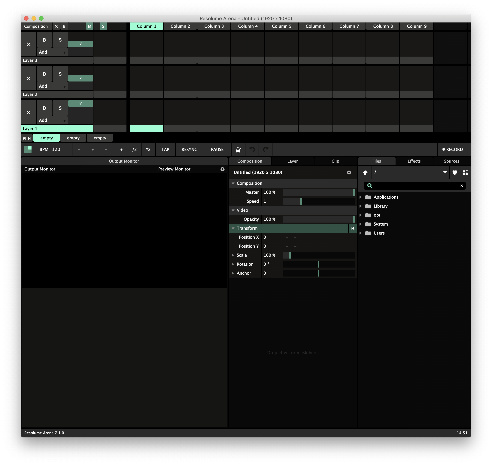
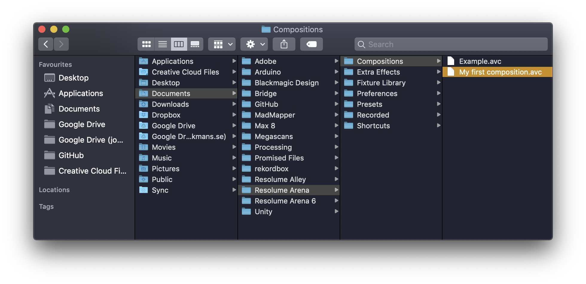

# Resolume

Resolume is an audiovisual performance tool. It enables you to play video and audio, and even use built-in generators for text and graphics. Mix them with each other, apply effects and output the results either for a live performance or for recording.

### Install

Download [Resolume Arena](https://resolume.com/download/) \(Avenue does not include advanced projection mapping possibilities\) and run the installation. This is the full package, but comes with watermarks on video and audio output unless a license is purchased.


Mute the sound of the computer to avoid hearing the audio watermark!


### Running Arena

Upon starting the application an example composition is presented. It's a great starting point, but ultimately a distraction. Create a new, click **Composition** and **New**, or **⌘N**.

Before deciphering the interface, let's simplify it a bit. Click **View** and untick **Audio Controls**, **Crossfader, Dashboard, Help** and **Compositions**. 

Ahhh, much better with a clean slate! Go to **Composition** and **Save**, or **⌘S**. A prompt will appear.

Name the composition and change the **Size** to **960x540**. The values should ideally reflect the final output ie. the resolution of the screen or projector where the visuals will be presented, but for learning it's better to go fast, and not have any lag.


Never have a larger composition size than what the projector or screen is set to output. This will only cause unnecessary strain on the computer.


Click **Save** and a new .avc file will be created in the Resolume folder, normally found under Documents.


The .avc file can be shared with others, but the video files are not embedded, so make sure that if collaborating to also sync the media.


_That's it! Let's go!!_

