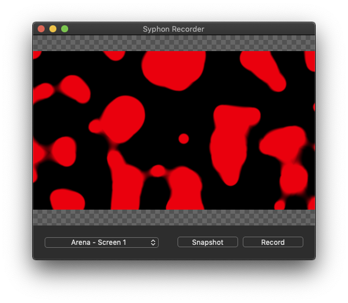

# Record

### Composition

For recording the current work displayed in the Monitor, simply press **RECORD** \(found to the right in the Layers window\) to start a recording and **STOP** when done. The recording will appear in the Resolume folder under Recordings, and the resolution will be that of the composition.

### Advanced Output

Fetching the mapped output composition is not as normal, but very useful for when a projection mapping sequence has been made, but a single file has to be delivered for playback, for instance for museums when there is a media player that can only handle video files.

To record the mapped output:

1. Install [Syphon Recorder](http://syphon.v002.info/recorder/)
2. Click **Advanced Output** under **Output**, and then select **Screen** and choose **Syphon** as the **Device**
3. Open Syphon Recorder and select "Arena - Screen 1" \(the name can differ\)
4. Press **Record** and perform the piece to be recorded
5. Press **Stop Recording** when done

