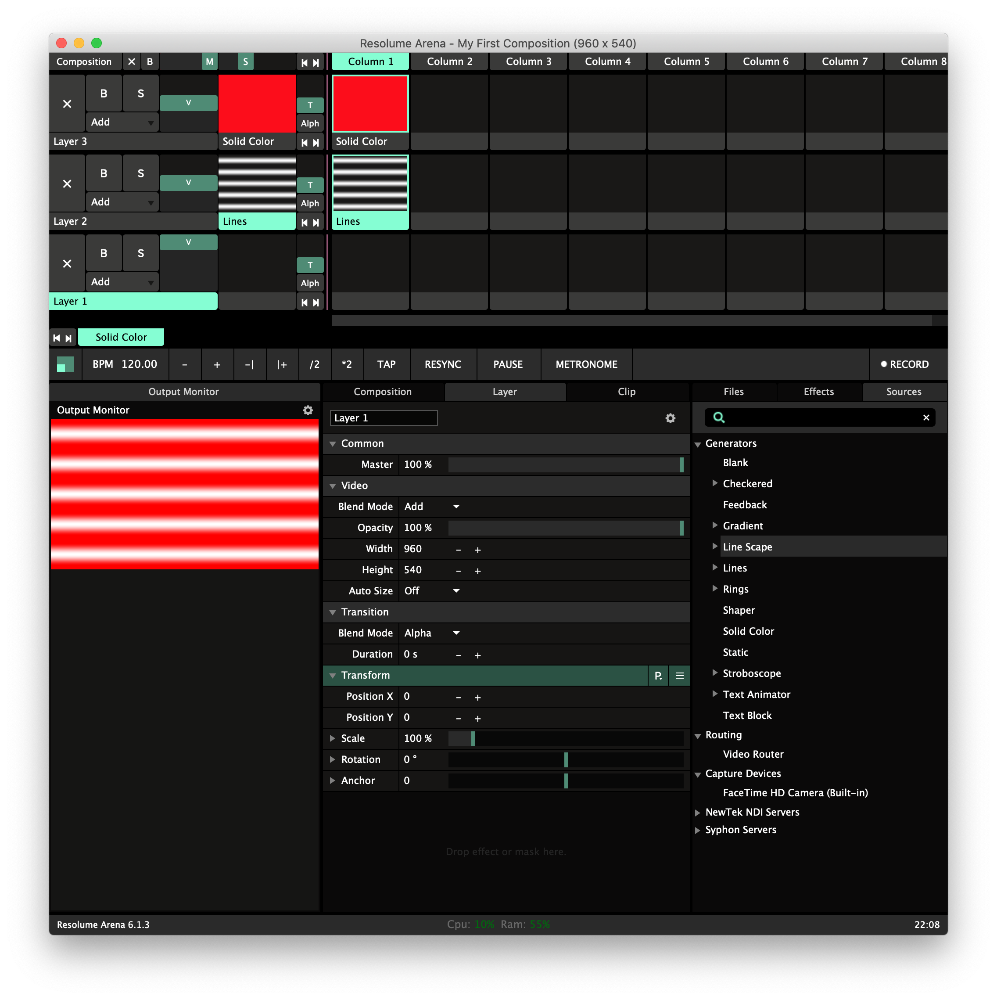

# Basics

### Clips

Have no video clips? Don't fret. Click **Sources** and drag a **Solid Color** and **Lines** to the top and second layer of the first column. These sources are **Generators**, packages of code written to create specific graphics. Once added, click them to turn them active.


There are several generators to explore, each with its own specific qualities. Try them out!


### Layers

Read from top to bottom, layers behave just like in other software as they are "stacked" on top of each other, and there's more:

* Each layer can be blocked \(**B**\), hiding it, or turned solo \(**S**\), making it the only layer visible.
* The video \(**V**\) slider adjust the opacity of the layer, with the slider default in the middle 50% is let through, at 100% the layer is fully opaque, and at 0% it is completely transparent.
* The **Add** selection reveals several blending modes defining how the pixels of the layer will blend. Change the Solid Color blending mode to Multiply and see how the white lines become red.
* Use **X** to clear the active clips of the layer.
* If there are several clips in the layer, the transition time \(**T**\) will create a graphical transition between the two layers of the duration. The default effect is **Alpha**, meaning that the original clip will slowly fade out, while the new clip will fade in. There are several effects beside the default!
* The bar where it says **Layer 3** is the layer handle.
  * Click to select the layer.
  * Click and drag to change its order.
  * Right click for more settings, such as renaming the layer.

### Effects

The list of effects can be found in the bottom right. To add an effect, drag and drop it on the video clip, the layer or the composition tab.

Here's a list of the most useful effects:

#### Image adjustment

* Add Subtract
* Auto Mask
* Blur
* Bright.Contrast
* ChromaKey
* Colorize
* Crop
* Flip
* Hue rotate
* Keystone
* Levels
* Mirror
* Recolour
* Saturation
* Solid Color
* Stripper
* Threshold
* Tint
* Vignette

#### Visual FX

* Displace
* Distortion
* Goo
* Shift Glitch
* Trails
* Twisted
* Wave Warp

**Pro tip:** To avoid confusion add effects to the composition, and to the layer when absolutely necessary.

### Adding files

It is possible to "drag and drop" files directly to Resolume, but the suggested way is to use the File Browser in the bottom right. Navigate to the folder containing the relevant media.

A suggested structure for organisation is:

* MY\_VIDEO\_FOLDER
  * ORIGINAL
    * my\_source\_file.mp4
  * EDITED
    * my\_edited\_file-1.mp4
    * my\_edited\_file-2.mp4
    * my\_edited\_file-3.mp4
  * ENCODED
    * my\_encoded\_file-1.mov
    * my\_encoded\_file-2.mov
    * my\_encoded\_file-3.mov

**Pro tip:** If the file does not play change the extension to "mov" \(Quicktime\).

### Advanced Output

[http://millumin.com/v2/index.php](http://millumin.com/v2/index.php) heavym

