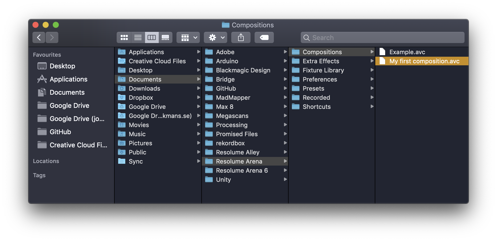

# Basics

Upon starting the application an example composition is presented. It's a great starting point, but ultimately a distraction. To create a new, click **Composition** and **New**, or **⌘N**.

Before deciphering the interface, click **View** and untick **Audio Controls**, **Crossfader, Dashboard, Help** and **Compositions**. Save by clicking **Layout** and **Save.** Name it "Simple".

Here is the simple layout along with an advanced version.





_The interface should now be easier to navigate!_

 To save this composition, go to **Composition** and **Save**, or **⌘S**. A prompt will appear.

Name the composition and change the **Size** to **960x540**. The values should ideally reflect the final output resolution \(most likely from a projector\), but for learning and experimenting it is less taxing on the computer to run at lower values.

Click **Save** and a new AVC file will be created in the Resolume folder, found under Documents. This file can be shared with others, but the video files are not embedded, so make sure that if collaborating to also sync the media.

### Transform

### Effects

The list of effects can be found in the bottom right. To add an effect, drag and drop it on the video clip, the layer or the composition tab.

Here's a list of the most useful effects:

#### Image adjustment

* Add Subtract
* Auto Mask
* Blur
* Bright.Contrast
* ChromaKey
* Colorize
* Crop
* Flip
* Hue rotate
* Keystone
* Levels
* Mirror
* Recolour
* Saturation
* Solid Color
* Stripper
* Threshold
* Tint
* Vignette

#### Visual FX

* Displace
* Distortion
* Goo
* Shift Glitch
* Trails
* Twisted
* Wave Warp

**Pro tip:** To avoid confusion add effects to the composition, and to the layer when absolutely necessary.

### Adding files

It is possible to "drag and drop" files directly to Resolume, but the suggested way is to use the File Browser in the bottom right. Navigate to the folder containing the relevant media.

A suggested structure for organisation is:

* MY\_VIDEO\_FOLDER
  * ORIGINAL
    * my\_source\_file.mp4
  * EDITED
    * my\_edited\_file-1.mp4
    * my\_edited\_file-2.mp4
    * my\_edited\_file-3.mp4
  * ENCODED
    * my\_encoded\_file-1.mov
    * my\_encoded\_file-2.mov
    * my\_encoded\_file-3.mov

**Pro tip:** If the file does not play change the extension to "mov" \(Quicktime\).

### Advanced Output

[http://millumin.com/v2/index.php](http://millumin.com/v2/index.php) heavym

