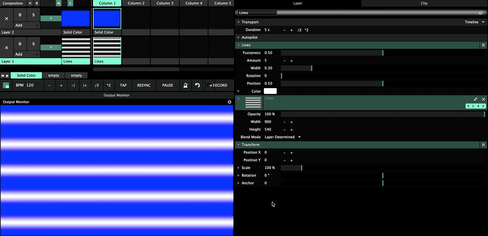

# Animation

Every parameter that has a changeable value \(that is not on/off\) can be animated! Hover the parameter name and a **cog** will appear, click it, and choose **Timeline**  from the menu. The parameter will animate from its minimum to its maximum with a default speed. 

On any parameter, click the **cog wheel** to the left of the parameter name. It will not show up unless the parameter name is hovered.

### Easing

It is possible to define how the animation eases from one value to the other. By default it is set to Linear. Click the **cog** again and choose **Envelope**. Add key frames and set easing modes!

