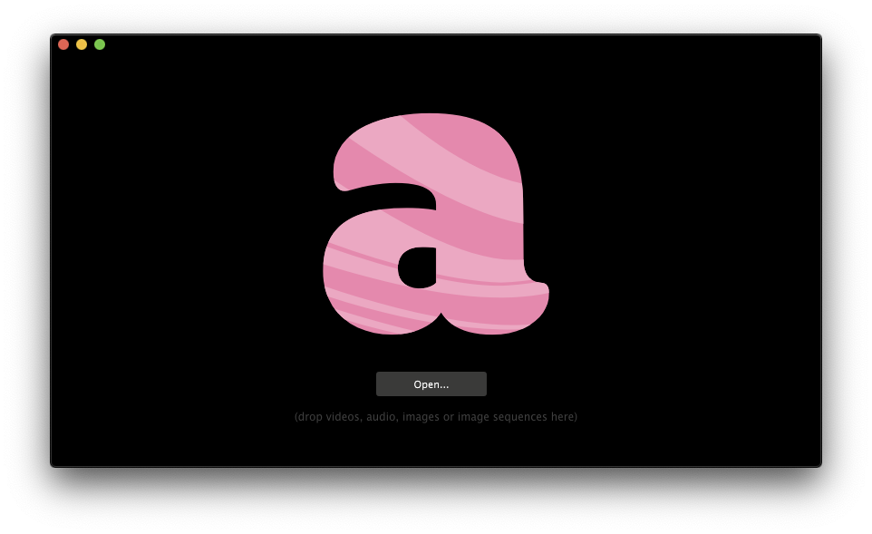

# Clips

Traditional audiovisual performances involve video clips, clips made from any software that exports video and image sequences, or from edited filmed or found footage. In Resolume, _clips_ can mean many things, and is essentially a catch-all for a wide range of content. It is possible to create beautiful things without even touching video editing, but it is often in the combination of the two that beautiful mysteries are unravelled.

_Have no video clips? Don't fret._ 

### Sources

Click **Sources** and drag a **Solid Color** and **Lines** to the top and second layer of the first column. These sources are **Generators**, packages of code written to create specific graphics. Click the clip thumbnail to activate it, or click the clip name just below, to see it in the **Preview Monitor**.

Besides the many generators, there are other sources available, such as the **Capture Devices** which enable connected web cameras and more. There is also NDI and Syphon, but leave that for another day.

### Files

If there are some video clips prepared, let's grab them. Click **Files** and browse. Once the folder is found, the files within should appear as thumbnails. Drag these to the layers just like the sources. It is also possible to ignore the built-in file system and simply drag and drop!

Accepted files are common image, audio and video formats. Video and audio content can be found on [Youtube](https://www.youtube.com/) and [Vimeo](https://vimeo.com/). To get a hold of the actual file use [Clipgrab](https://clipgrab.org/) or [Keepvid](http://keepvid.com/). Choose the highest resolution when downloading, and pay respect to copyright restrictions.


Create a dedicated folder for your files and avoid having them in **Downloads**. Design the workflow with live performances in mind where lighting conditions are poor and it is crucial to find things fast.


### Preparing content

#### Partitioning

Attempt to divide a clip into multiple smaller ones, this allows for a flexible set where the performer can efficiently create compositions that does not feel repetitive.

1. Open Quicktime Player
2. File &gt; Open File &gt; Select video clip
3. Edit &gt; Trim
4. Drag to select start and end frame
5. Trim and save!

Consider the length and the pacing of the clip, there is no definite rule but between 5 to 20 seconds is normally good. It's great to try and structure ones material based on pacing as we strive for dynamic compositions that enhance the music and keep the energy going.

#### Video conversation

Depending on the specifications of the machine, the video files may stagger when being played. Resolume comes with DXV, a codec that decompress the video frames on the GPU instead of the CPU, and Alley, a video conversion software. [Check out the official guide](https://resolume.com/support/conversion-with-alley).


Converting to DXV can take a considerable amount of time so be sure to have at least a few hours available.


