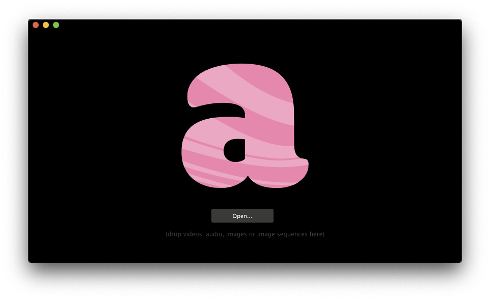

# Preparing content

### Partitioning

Attempt to divide a clip into multiple smaller ones, this allows for a flexible set where the performer can efficiently create compositions that does not feel repetitive.

1. Open Quicktime Player
2. File &gt; Open File &gt; Select video clip
3. Edit &gt; Trim
4. Drag to select start and end frame
5. Trim and save!

Consider the length and the pacing of the clip, there is no definite rule but between 5 to 20 seconds is normally good. It's great to try and structure ones material based on pacing as we strive for dynamic compositions that enhance the music and keep the energy going.

### Video conversation

Depending on the specifications of the machine, the video files may stagger when being played. Resolume comes with DXV, a codec that decompress the video frames on the GPU instead of the CPU, and Alley, a video conversion software. [Check out the official guide](https://resolume.com/support/conversion-with-alley).


Converting to DXV can take a considerable amount of time so be sure to have at least a few hours available.


