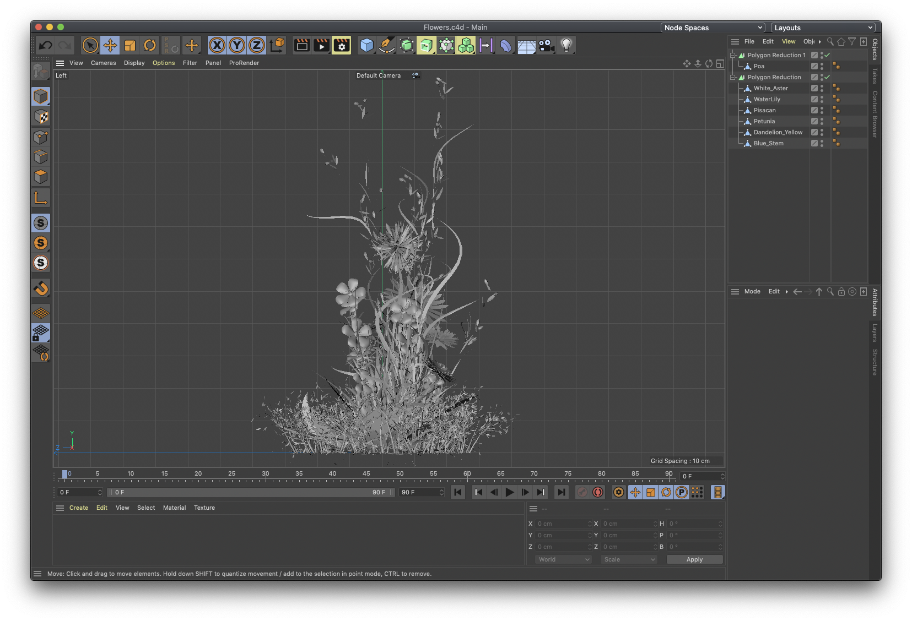

# Reducing 3D files

Since Spark has a file size limit of 4mb models must be reduced in order to fit within the constraints.

The polygon reduction has already helped immensely, reducing the amount of polygons in the scene with up to 90%. Let's see what size the different export options yield.

| Filetype | File size \(mb\) |
| :--- | :--- |
| Flowers.c4d | 14.7 |
| Flowers.obj | 13.3 |
| Flowers.fbx | 4.7 |
| Flowers.gltf | 2.2 |
| Flowers.glb | 1.7 |

