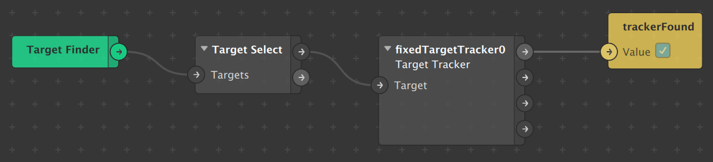

# Target Tracker

* [https://sparkar.facebook.com/ar-studio/learn/documentation/tracking-people-and-places/target-best-practice/](https://sparkar.facebook.com/ar-studio/learn/documentation/tracking-people-and-places/target-best-practice/)
* [https://sparkar.facebook.com/ar-studio/learn/documentation/tracking-people-and-places/effects-in-surroundings/creating-a-target-ar-effect/](https://sparkar.facebook.com/ar-studio/learn/documentation/tracking-people-and-places/effects-in-surroundings/creating-a-target-ar-effect/)

## Found



```javascript
const P = require("Patches");
var trackerFound = P.getBooleanValue("trackerFound");

trackerFound.monitor().subscribe(function(e) {
  Diagnostics.log(e.newValue);
});
```



* [https://sparkar.facebook.com/ar-studio/learn/documentation/reference/classes/patchesmodule/](https://sparkar.facebook.com/ar-studio/learn/documentation/reference/classes/patchesmodule/)
* [https://sparkar.facebook.com/ar-studio/learn/documentation/reference/classes/scenemodule.targettracker/](https://sparkar.facebook.com/ar-studio/learn/documentation/reference/classes/scenemodule.targettracker/)
* [https://sparkar.facebook.com/ar-studio/learn/documentation/reference/classes/Rmodule.boolsignal/](https://sparkar.facebook.com/ar-studio/learn/documentation/reference/classes/Rmodule.boolsignal/)



```javascript
const targetTracker = Scene.root.child("fixedTargetTracker0");
var isTracking = targetTracker.isTracking;

isTracking.monitor().subscribe(function(e) {
  Diagnostics.log(e.newValue);
});
```



