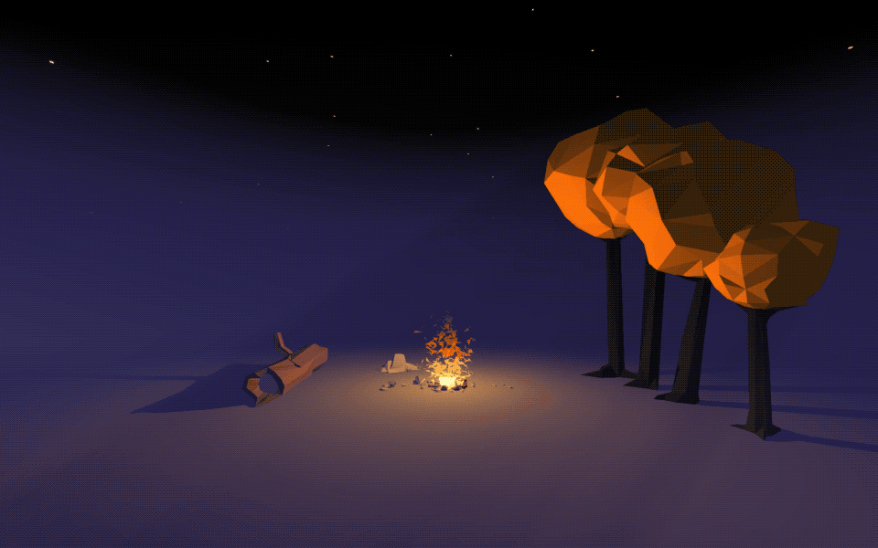

# A-Frame

[A-Frame](https://aframe.io/) is a web framework built on [Three.js](https://threejs.org) for building mixed reality experiences. It is made possible thanks to the Web Graphics Library \(WebGL\).

### Install

A-Frame runs in the browser and is included as a JavaScript library in an HTML document. Use an online editor such as [Glitch](../../tools/glitch.md) \(choose New Project and Hello Webpage\) or create an index.html file locally using [Visual Studio Code](https://code.visualstudio.com/) or [Sublime Text](https://www.sublimetext.com/).

Visit [Campfire VR](https://curious-electric.com/w/experiments/aframe/campfirevr/) \([article](https://medium.com/@dirkk/campfire-vr-fa654d15e92a)\) for an example of what can be made.

### Is this coding?

There are several level of abstractions of code. At the bottom, you have the electrical components which are either on \(1, true\), or off \(0, false\). Then, you have machine language, series of commands that tell electrical components how to behave. 

Since machine language is very complex, a layer on top has been written to make it easier. You can think of this layer as the Operative System \(Windows, Mac, Linux\). And once you're in the OS there's plenty of types of languages of code which can be used: C++, Python, Java and JavaScript, which is used in the browser.

So, all the way from the electrical component we have finally reached A-Frame, which uses a combination of HTML and JavaScript. HTML is known is a markup language, meaning, it uses special building blocks to define how the content of a website is displayed. A-Frame has taken advantage of this, and created their own blocks, that through JavaScript, define the 3D scene. 

Using A-Frame, you are definitely coding, it just looks a bit different than how coding is normally presented. But rest assured, there are several ways of coding, some that  don't even require typing.

