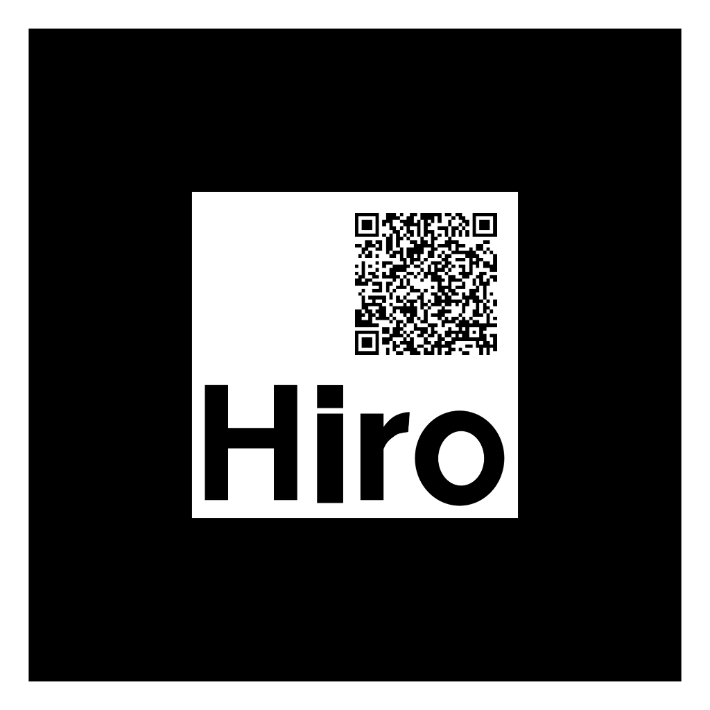

# Augmented Reality

AR in the browser has three tracking methods available: **Marker**, **Location** and **Image**. The augmented reality super powers are made possible by including [AR.js](https://ar-js-org.github.io/AR.js-Docs/) in the `<head>`. Also read [10 tips to enhance your AR.js app](https://medium.com/chialab-open-source/10-tips-to-enhance-your-ar-js-app-8b44c6faffca) for tips on performance.

## Marker

[Markers](https://ar-js-org.github.io/AR.js-Docs/marker-based/) are black and white and used with the `<a-marker>` entity. Create a site using the code below \(or [visit this example in your phone](https://codepen.io/nicolocarpignoli/full/vMBgob)\) and look at the marker to better understand its usage.



```markup
<html>
  <head>
    <script src="https://unpkg.com/aframe@latest"></script>
    <script src="https://raw.githack.com/AR-js-org/AR.js/master/aframe/build/aframe-ar.js"></script>
  </head>
  <body>
    <a-scene vr-mode-ui="enabled: false;" embedded arjs>
      <a-marker preset="hiro" smooth="true">
        <a-box color="red"></a-box>
      </a-marker>
      <a-entity camera></a-entity>
    </a-scene>
  </body>
</html>
```







In case the preset default marker is not special enough it's possible to design your own! The custom design should:

* Be square
* JPEG
* Include no transparency
* Preferably be black and white \(strive for contrast\)
* Have at least 10% distance to the edges
* Not be mirrored ie. no identical sides

Once the image is made:

1. Visit the [Marker Generator](https://ar-js-org.github.io/AR.js/three.js/examples/marker-training/examples/generator.html)
2. Upload the image
3. Download the Marker pattern file and the Marker image
4. Upload the pattern file and reference it in the code.

```markup
<html>
  <head>
    <script src="https://unpkg.com/aframe@latest"></script>
    <script src="https://raw.githack.com/AR-js-org/AR.js/master/aframe/build/aframe-ar.js"></script>
  </head>
  <body>
    <a-scene embedded arjs="debugUIEnabled: false">
      <a-marker type="pattern" url="YOUR_MARKER_PATH.patt">
        <a-box color="red"></a-box>
      </a-marker>
      <a-entity camera></a-entity>
    </a-scene>
  </body>
</html>
```

### Changing the Pattern Ratio

It is possible to have a higher ratio than the default 0.5, but by doing so it's also imperative to tell A-Frame that the new marker has changed. By adding the **patternRatio** to the **arjs** attribute of `<a-scene>` this can be accomplished!

```markup
<a-scene embedded arjs="patternRatio: 0.7">
```

## Location

To use location, [get your GPS coordinates](https://jonasjohansson.glitch.me/toolkit/html/getgps.html) and make notes of the latitude and longitude values.

```markup
<html>
  <head>
    <script src="https://unpkg.com/aframe@latest"></script>
    <script src="https://raw.githack.com/AR-js-org/AR.js/master/aframe/build/aframe-ar.js"></script>
  </head>
  <body>
    <a-scene embedded arjs="debugUIEnabled: false">
      <a-marker type="pattern" url="YOUR_MARKER_PATH.patt">
        <a-box color="red"></a-box>
      </a-marker>
      <a-entity camera></a-entity>
    </a-scene>
  </body>
</html>
```

[https://medium.com/chialab-open-source/build-your-location-based-augmented-reality-web-app-c2442e716564](https://medium.com/chialab-open-source/build-your-location-based-augmented-reality-web-app-c2442e716564)

## Image

It is recently possible to use imagery as a marker, thanks to Natural Feature Tracking \(NFT\). For NFT to work, the system has to be trained with a surface in advance to recognise and track the surface. The training can be done using the [NFT Marker Creator](https://github.com/Carnaux/NFT-Marker-Creator) \(recommended\) or the[ online  version](https://carnaux.github.io/NFT-Marker-Creator-Web/) \(max width and height less than 1000px\). The image should also follow the [NFT Image Constraints](https://github.com/kalwalt/jsartoolkit5/blob/fixing-nft/doc/NFT_image_constraints.md) \(rectangular, JPEG\).


Make sure the file extension is visible, or the marker creator may not run the file.


_Insert example for A-Frame and custom NFT marker here._

To test whether the image is a great candidate for AR, upload it to [Vuforia's Target Manager](https://developer.vuforia.com/) \(developer account is free\) and proceed based on the result.


For reference on ideal data, this [Augmented Reality Marker Generator](http://www.brosvision.com/ar-marker-generator/) creates images that are ideal for tracking.



