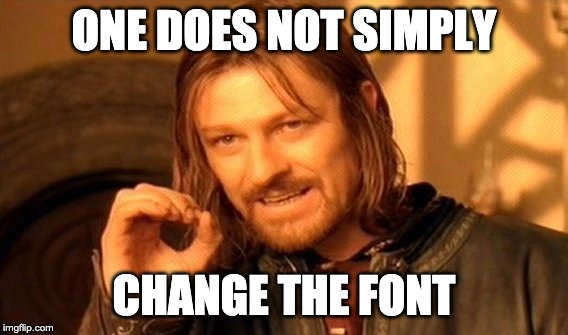

# 7. Text


Use the [A-Frame Troika Text](https://github.com/lojjic/aframe-troika-text) component for a more effective process.


Rendering text in 3D is not trivial, but the `<a-text>` component does make things breezy!

```markup
<a-text value="AaBb"
        position="0 1 -2"
        color="red"
        align="center">
</a-text>
```

By adding the above in your `<a-scene>` you will see a text block which can be used just like any other entity. It comes with a [bunch of attributes and configuration](https://aframe.io/docs/0.9.0/components/text.html):

| Attribute | Default |
| :--- | :--- |
| align | left |
| color | \#fff |
| font | roboto |

### Background

In situations where you require a background color to make the text legible, add a `plane` or `box` geometry with a coloured material. To have the geometry automatically scale with the text, set the geometry component’s `width` and `height` properties to`auto`.

```markup
<a-text value="And as he was falling down the cliff he thought 'Finally, something is happening to me!'"
        position="0 1 -2"
        color="white"
        geometry="primitive: plane; width: auto; height: auto"
        material="color: black"
        align="left">
</a-text>
```

### Changing font



Here's where it gets a bit tricky as you can't include non-standard fonts like you would with stylesheets. [A-Frame provides alternatives](https://aframe.io/docs/0.9.0/components/text.html#stock-fonts) but if you want to use your own, here's what you do.

1. Find a font that you like, for example [Underdog](https://fonts.google.com/?category=Display&selection.family=Underdog).
2. Get the TTF version of the font. If there is none convert the one you have using [Transfonter](https://transfonter.org).
3. Visit [https://msdf-bmfont.donmccurdy.com/](https://msdf-bmfont.donmccurdy.com/) and upload the TTF.
4. Provide the character set you wish to use. Fewer characters means the file will be lighter. [Underdog provides a character set](https://fonts.google.com/specimen/Underdog).
5. Depending on the amount of characters you may be prompted to increase the texture size, 512px seemed to work in this case.
6. Create and download!

As you unarchive the font you will see it is now split into a JSON and a PNG file. The JSON references the PNG so they need to stay together. If you are using Glitch you must reference the PNG explicitly using the _font-image_ attribute.

```markup
<a-text value="CcDd"
        font="Underdog-Regular-msdf.json"
        font-image="https://cdn.glitch.com/c9111e7d-1d31-41a0-8e15-78b57caa9816%2FUnderdog-msdf.png?v=1570442732551"
        color="orange"
        align="center"
        negate="false">
</a-text>
```

### Text geometry

You may have noticed that the previous example appears flat and lacks 3d geometry. Luckily, the [A-Frame Text Geometry Component](https://www.npmjs.com/package/aframe-text-geometry-component) can remedy this situation along with the [Facetype font converter](http://gero3.github.io/facetype.js/) \(follow the same steps as above but using this site instead\). 

```markup
<script src="https://unpkg.com/aframe-text-geometry-component@^0.5.0/dist/aframe-text-geometry-component.min.js"></script> 
```

Create an entity using the new component and reference the new JSON type file, no fontImage needed:

```markup
<a-entity
    text-geometry="value: EeFf; font: Underdog-Regular-msdf.json;"
    material="color: orange">
</a-entity>
```


Remember to always position entities so they are visible to the camera using for instance `position="0 1.6 -1"` which will place the entity on the same height as the camera, and move it away slightly.


