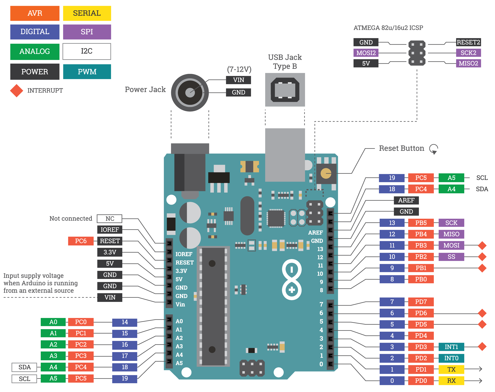

# Arduino

Arduino is a brand of open-source electronics platform, based on easy-to-use hardware and software. Arduino boards can read inputs: light on a sensor, a finger on a button, or a Twitter message, and turn it into an output: activating a motor, turning on an LED or publishing something online. You can tell your board what to do by sending a set of instructions \(the code\). 

Arduino comes in [many shapes with various purposes](https://makezine.com/comparison/boards/), and other brands exist as well. However, the traditional Arduino Uno is a staple in education, and useful even though it's been around since 2005.



### Install

Get Arduino \([Mac](https://www.arduino.cc/en/Guide/MacOSX), [Windows](https://www.arduino.cc/en/Guide/Windows)\), open the app and find a new window, named with the current date, containing some basic code.

> Before we continue further, go to Arduino &gt; Preferences and tick "Display line numbers" and "Enable code folding".

A project in Arduino is called a **sketch**, and the default example includes the following:

```javascript
void setup() {
}

void loop() {
}
```

Both **setup** and **loop** are **functions**. We use functions as a way to recycle code; without them, we would have to repeat our instructions. By use of functions, we can write complex code, include it in our function, and then "call it".

In the setup and loop case, these function are pre-made by Arduino and have specific roles; setup is called once and happens before the loop, while loop is being called continuously. _It is also possible to write our own functions._

### Connect

Connect the Arduino Uno with an A-B USB cable. The USB connection is necessary to program the board and not just to power it up. The Uno automatically draw power from either the USB or an external power supply. When connected, the green power LED \(labelled PWR\) should light up.

### Upload

Before uploading the sketch, make sure the correct items are selected under **Tools &gt; Board** and **Tools &gt; Port**. On the Mac, the serial port something like `/dev/tty.usbmodem241`.


Any time the Arduino is connected to a different USB port the serial port may have to be selected again. This is especially true if using a USB adapter for a laptop eg. newer Macbooks.


With everything set click the Upload button \(right arrow symbol in the top left\) or ⌘+U. When uploading the orange transmission LED \(labelled TX\) should flicker.

Congratulations! The Arduino should now be successfully connected to the computer, and the first piece of code is uploaded.


When code is uploaded it "stays" on the Arduino and only uses the USB cable for power!


