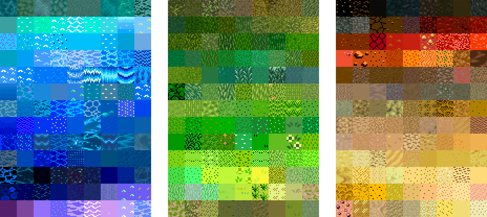

# Bitsy

Bitsy is a small emulator for small worlds made by [Adam Le Doux](https://twitter.com/adamledoux). However, this simplicity is incredibly useful for making focused and deliberate ideas. It gives every choice a lot of **weight**.

### Install

Bitsy \([link](http://ledoux.io/bitsy/editor.html)\) runs in the browser and requires no installations. There is also an advanced standalone version named [Bitsy Savior](https://aloelazoe.itch.io/bitsy-savior).

### Tools

There are several other minimal game design tools that can be of interest, such as [Twine](https://twinery.org/), [Pico-8](https://www.lexaloffle.com/pico-8.php), [Voxatron](https://www.lexaloffle.com/voxatron.php) and [PuzzleScript](https://www.puzzlescript.net/). For more advanced types of editors check out [Phaser](https://phaser.io/), [Gdevelop](https://gdevelop-app.com/), [GameMaker](https://www.yoyogames.com/), [Babylon](https://www.babylonjs.com/games/) and [RPG Maker](https://en.wikipedia.org/wiki/RPG_Maker).

### Inspiration

Bitsy is nurturing creatives of all types and sizes, and spreading the joy game-driven stories. Read the [Wiki](https://bitsy.fandom.com/wiki/Bitsy_Wiki), follow [Bitsy Pieces](https://twitter.com/bitsypcs), join [Bitsy Talk](https://discordapp.com/invite/9rAjhtr), play some [Bitsy Faves](https://itch.io/c/201121/bitsy-faves) and check [games tagged Bitsy on Itch](https://itch.io/games/tag-bitsy).

#### Great Bitsy games

| Title | Author |
| :--- | :--- |
| [Unseen Light](https://ducklingsmith.itch.io/the-unseen-light) | [David Mowatt](https://ducklingsmith.itch.io/) |
| [Spoons](https://le-onionboi.itch.io/spoons) | [Onion Boi](https://le-onionboi.itch.io/) |
| [Expecting](https://sebypops.itch.io/expecting) | [Sebypops](https://sebypops.itch.io/) |
| [In the pines](https://laurahunt.itch.io/in-the-pines) | [Laura Hunt](https://laurahunt.itch.io/) |
| [Exhume](https://batgut.itch.io/exhume) | [Dan Dudley](https://batgut.itch.io/) |
| [Bitsy Spider](https://rabbitboots.itch.io/bitsy-spider) | [Rabbit Boots](https://rabbitboots.itch.io/) |
| [Flotsam](https://candle.itch.io/flotsam) | [Mark Wonnacott](https://candle.itch.io/) |
| [Shoal](https://candle.itch.io/shoal) | [Mark Wonnacott](https://candle.itch.io/) |
| [I heard a dog barking](https://saranomy.itch.io/ihadb) | [Saranomy](https://saranomy.itch.io/) |
| [Silence would be better](https://cephalopodunk.itch.io/silence-would-be-better) | [Cephalopodunk](https://cephalopodunk.itch.io/) |
| [tsfetsciyrithsamwys](https://cephalopodunk.itch.io/tsfetsciyrithsamwys) | [Cephalopodunk](https://cephalopodunk.itch.io/) |
| [I Wonder](https://seansleblanc.itch.io/i-wonder) | [Sean Leblanc](https://seansleblanc.itch.io/) |
| [Third Crypt](https://jctwood.itch.io/thirdcrypt) | [Jctwood](https://jctwood.itch.io/) |
| [Penroses](https://rarelikeaunicorn.itch.io/penroses) | [Rare like a unicorn](https://rarelikeaunicorn.itch.io/) |
| [No Destination](https://candle.itch.io/no-destination) | [Marc Wonnacott](https://candle.itch.io/) |
| [Tunnel](https://jctwood.itch.io/tunnel) | [Jctwood](https://jctwood.itch.io/) |

For more than inspiration, play some games — Install [Steam](https://store.steampowered.com/), and frequent sites like [Game Curator](https://game-curator.com/) and [Game Jolt](https://gamejolt.com/), and challenge yourself[ in "game jams"](https://itch.io/jam/) such as [Ludum Dare](https://ldjam.com/)!

Below are some other types of games which are all very much worth playing.

| Title | Creator |
| :--- | :--- |
| [Forward](https://citron-curieux.itch.io/forward) | [Citron Curieux](https://citron-curieux.itch.io/) |
| [To the moon](https://freebirdgames.com/to_the_moon/) | [Freebird Games](https://freebirdgames.com/) |
| [ORUL](https://egordorichev.itch.io/orul) | [Egor Dorichev](https://egordorichev.itch.io/) |
| [The Talos Principle](https://store.steampowered.com/app/257510/The_Talos_Principle/) | [Croteam](http://www.croteam.com/) |
| [Untitled Goose Game](https://goose.game/) | [House House](http://househou.se/) |
| [That Dragon, Cancer](http://www.thatdragoncancer.com/) | [Article](https://www.wired.com/2016/01/that-dragon-cancer/), [documentary](http://www.thankyouforplayingfilm.com/) |

Peaked your interest in creating games? Get fired up by reading the [Scratchware Manifesto](http://homeoftheunderdogs.net/scratch.php) and [some great rants](https://voec.itch.io/zineszineszines). And if curious about game design, make sure to read:

* [Rules of Play](https://en.wikipedia.org/wiki/Rules_of_Play)
* [Game Design Reader](https://www.adlibris.com/se/e-bok/game-design-reader-9780262303170)
* [Governing by Video Game](https://onezero.medium.com/governing-by-video-game-b8c7a82fdfbd)
* [Enchanted Objects](https://www.goodreads.com/book/show/18143776-enchanted-objects)

### The Spriters Resource

It is fortunate designing pixel games, as so much has already been made, so there's lots of great inspiration out there. [The Spriters Resource](https://www.spriters-resource.com/) rips the sprite sheets from games, so that others may understand better the graphic design within classic games like Final Fantasy or Super Mario.

