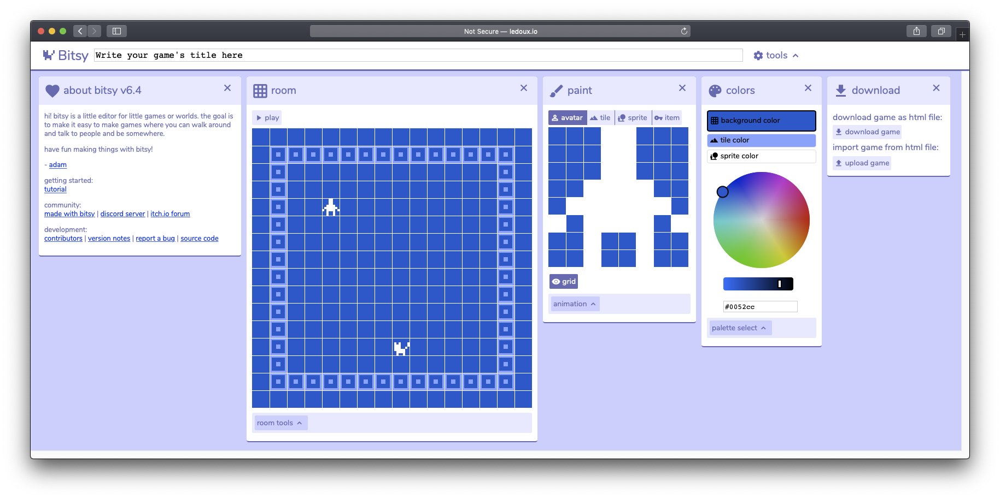

# 1. Editor

* **Top**: Edit the name of your Bitsy project
* **Room:** The level editor which your player will move in.
* **Colors**: Bitsy uses only 3 colors!

All windows can be rearranged and closed. Click on Tools to see a list of windows available! Hovering over anything brings up a description.

In the **room** window, hit the play button. You should be able to move the character around with the arrow keys. Walk over to the cat!

