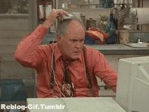

# Cables

Programming is forever evolving and the traditional method of punching in lines of code is no longer the only way forward. Cables attempts to fast forward web development by introducing a node based and easy-to-understand creative environment.

### Install

[Cables](https://cables.gl/home) runs in the browser and requires no installation. Create an account to enable saving and sharing. Ask questions in the [forum](https://forum.cables.gl/) and use the [documentation](https://cables.gl/docs/docs) and [examples](https://cables.gl/examples) page for inspiration.

Make sure you use a mouse instead of a trackpad!

