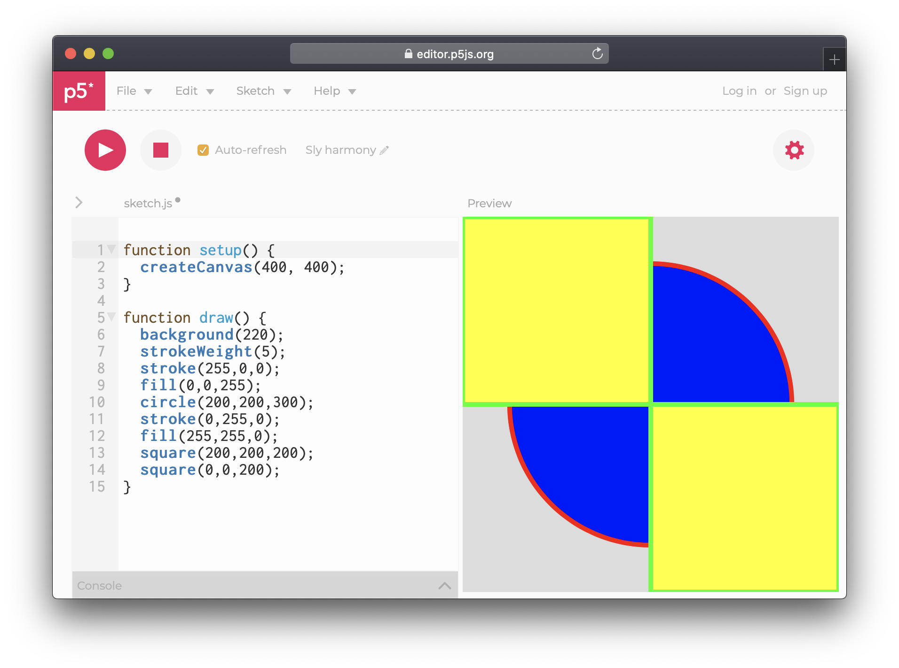
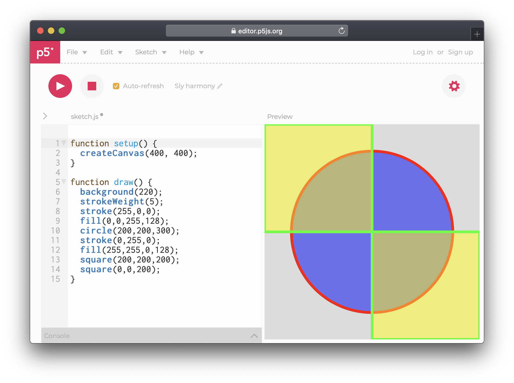

# 4. Color

Colors are most commonly represented with **RGB \(Red, Green, Blue\)** or **HSB \(Hue, Saturation, Brightness\)**.

All shapes are by default white, with a 1 pixel black outline. To change this we use the functions `stroke()` and `fill()` and add them _before_ our shape. Since code is read from top to bottom, whatever becomes before the shapes will be applied.


The draw function does not reset itself, and remembers the values set the last time.


## Stroke

Let us make outline of the circle red by typing `stroke(255, 0, 0)` **before** the circle, and our squares green by typing `stroke(0, 255, 0)` before the squares. We can also increase the stroke thickness  using the [**strokeWeight** ](https://p5js.org/reference/#/p5/strokeWeight)function with a value in pixels.



To remove a stroke, type `noStroke()` before the shapes that should be without.


## Fill

The shape background color works similarly to stroke. Let us turn our circle blue by typing `fill(0,0,255)` and the squares yellow by typing `fill(255,255,0)` 



## Alpha

So far, we know that we can choose the amount of Red, Green and Blue, but there is also a fourth value: Alpha. The alpha decides the opacity, the amount of "see-through" which our color can have.

The alpha value by default is also a value between 0 and 255. For example at line 12 we set the color to be yellow \(a mix of **R**ed and **G**reen, without **Blue**\), with a alpha \(transparency\) of 128:

```javascript
fill(255,255,0,128);
```



