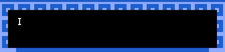

# 10. Dialog

When you make an item or sprite in Bitsy, you can set their **dialog** in the **paint window.** But if you need more complex options, you can open the dialog window for further abilities.

## Long texts

By clicking **new section** it is possible to add additional dialog, lists of boxes, and conditional dialog trees. You can also these in order so they lead into each other. **The order can not be easily changed so plan well.** To see what is happening under the hood, click **show code**.

### List

There are 3 orders which text can appear: 

* Shuffle picks randomly between the lines of dialog
* Cycle runs through each line of dialog in order, repeatedly.
* Sequence runs through each line of dialog exactly once, without repeating.


If you are not seeing changes you are making, refresh the page. If you try to change the dialog while the game is running, sometimes it stops saving changes and you will have to refresh to have it start again. 


### Conditional

In the **inventory** window, you will see a list of all the items in your game. Items are collectables. When you walk over them, they disappear with an optional line of dialog. Bitsy keeps track of how many of each item you have collected. You can see the number next to your item increase as you walk over them in your game. 

In the conditional window, you can set the dialog to be different depending on how many items of which type you have picked up!

[**https://cephalopodunk.itch.io/bullshit-fish-names/devlog/23122/time-for-some-rambling-about-dialog**](https://cephalopodunk.itch.io/bullshit-fish-names/devlog/23122/time-for-some-rambling-about-dialog) ****

[**https://ayolland.itch.io/trevor/devlog/29520/bitsy-variables-a-tutorial**](https://ayolland.itch.io/trevor/devlog/29520/bitsy-variables-a-tutorial) ****

## Text effects

It's possible to stylise letters, words and full sentences using the predefined text effects. There are 6 built-in options to choose from, which can also be stacked together…



 You can click the buttons to add the effect but it is recommended to add them by typing, as it is possibly to use the conventional ⌘+Z to undo,

```css
{clr1} Color 1 {clr1}
{clr2} Color 2 {clr2}
{clr3} Color 3 {clr3}
{wvy} Wavy {wvy}
{shk} Shaky {shk}
{rbw} Rainbow {rbw}
{wvy} {rbw} Wavy Rainbow {rbw} {wvy}
```

## Related links

* [https://cephalopodunk.itch.io/bullshit-fish-names/devlog/23122/time-for-some-rambling-about-dialog](https://cephalopodunk.itch.io/bullshit-fish-names/devlog/23122/time-for-some-rambling-about-dialog) 
* [https://ayolland.itch.io/trevor/devlog/29520/bitsy-variables-a-tutorial](https://ayolland.itch.io/trevor/devlog/29520/bitsy-variables-a-tutorial) 

